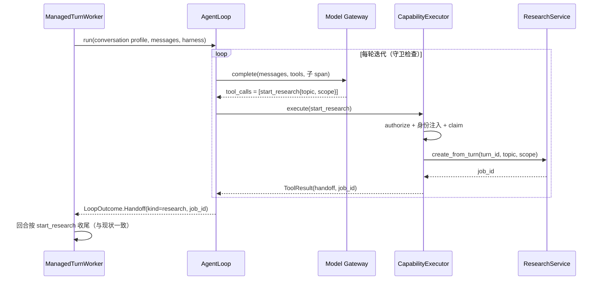

# LLM + Harness：统一 AgentLoop 开发任务与验收

日期：2026-10-09  
核对基线：`ba2d2b8`（含未提交的 Replay-M3 工作区改动）。  
状态：总览；逐步任务见 [`docs/agent-loop-m1/`](agent-loop-m1/README.md)。本文中的新增模块、配置项、测试编号均为建议方案，尚未实现。  
阶段简称：`Loop-M1`。与既有 M2/M3/M5、Replay-M3 编号互不影响。  
计划文档：**已锁定方案 B**（先流式输出正文，再调用 `publish_plan_document` 绑定并保存）。

## 1. 目标与完成标准

把现有分散的决策逻辑收敛到一个共享的 `AgentLoop`：模型通过原生 tool call 决定“下一步做什么”，Harness 负责执行、约束、挂起与恢复。各业务链路不再各写一套循环，而是声明一个 `AgentProfile`。

本阶段交付：

1. 一个与业务无关的 `AgentLoop` 实现，统一迭代、终止、挂起、守卫、身份与快照绑定。
2. 对话链路改用 `AgentLoop`，并把“开研究、找专家、记住信息、澄清”从循环外的正则、分类调用和控制头搬进循环，成为模型可选择的能力。
3. 目标执行的单步 ReAct 改用 `AgentLoop`，`decide` 的自定义 action JSON 改为原生 tool call 加终止型工具。
4. 一套路由与行为评测集，用来证明新路径不比旧路径差，再删除旧路径。

完成判定以“旧路径可以删除”为准：新路径在评测集上达到第 7 节门禁，且既有回归无新增失败。

## 2. 现状与事实

### 2.1 现有循环

| 链路 | 循环位置 | 决策方式 | 守卫 |
|---|---|---|---|
| 对话 | `live_model.py::LiveConversationModel._route_and_respond`，1520–1590 行 | 原生 tool call，最多 8 轮（`MAX_CHAT_TOOL_ITERATIONS`）；可用 `ask_user`、`review_check_in`、goal 业务工具、MCP 工具 | 同一失败调用重复两次即停止工具并要求回答 |
| 目标执行 | `runtime.py::AgentRuntime._execute_step`，557–786 行 | `LiveRuntimeModel.decide` 返回 action JSON：`complete_step / continue / await_outcome / tool_call / blocked`，每轮最多一个工具 | 单步墙钟时间、每步迭代数（默认 5）、相同动作次数、连续工具错误 |
| 专家 | `agents.py::ManagedAgentWorker` | 无循环；固定扇出 researcher/planner/critic，各调一次模型，再综合 | lease 与心跳 |
| 研究 | `research/engine.py::ResearchEngine.run_research` | 无循环；固定流水线，各阶段失败走规则兜底 | 阶段超时 |

两个循环的守卫互不相通：对话循环没有墙钟和相同动作预算，目标循环没有“重复失败即停”。

### 2.2 循环外的决策

对话链路中，以下决策发生在进入工具循环之前，模型在循环内看不到这些选项：

| 决策 | 当前实现 | 位置 |
|---|---|---|
| 开深度研究 | 正则 `_is_explicit_research_command`、`_has_research_intent_signal`，加分类调用 `_classify_explicit_research_request`，命中后伪造控制头 v3 | `live_model.py` 125–138、1180–1186 行 |
| 找专家 | 正则 `_explicit_expert_request`，命中后伪造控制头 v4 | `live_model.py` 140–153、1168–1179 行 |
| 记住信息 | 分类调用 `_classify_explicit_remember`，命中后直接写记忆并伪造控制头 | `live_model.py` 1142–1167 行 |
| 保存已有计划 | 正则 `_is_plain_existing_plan_save`，直接返回 | `live_model.py` 1134–1139 行 |
| 计划文档意图 | 控制头 v2 `artifact`，加分类调用 `_classify_explicit_plan_document_request`、`force_plan_document` 补发、降级 | `live_model.py` 1495–1660 行 |
| 路由总协议 | 首行 JSON 控制头 v1–v4，`policy ∈ {answer, propose_execution, clarify, start_research, start_expert}` | `conversation.py::ControlHeadDecoder` |

控制头被 `ManagedTurnWorker.run_once`（`conversation.py` 1669–3806 行）消费：`start_research` 调 `ResearchService.create_from_turn`，`start_expert` 调 `AgentTaskService.create_run`，二者都会把当前回合直接置为 `COMPLETED`，后续消息由研究任务或专家任务自己写入会话。

### 2.3 可直接复用的 Harness 能力

| 能力 | 现有对象 | 本阶段用法 |
|---|---|---|
| 工具注册、授权、审批、幂等 claim、对账恢复 | `tools.py::ToolRegistry.authorize/execute_async` | 原样复用；新能力以 `ToolSpec(context_handler=...)` 注册 |
| 对话工具执行、审批挂起、续写恢复 | `chat_tools.py::ChatToolRunner.execute/resume`、`ChatToolCallStore` | 作为对话 Profile 的执行器适配层 |
| 调用身份与 span | `execution_context.py::HarnessExecutionContext`、`create_child_context` | 每轮模型调用一个子 span，每个工具一个子 span |
| 输入快照、预算、准入 | `model_gateway.py`、`model_control.py`、`model_input_snapshot*.py` | 不改；循环每轮仍走网关的冻结与准入 |
| 研究任务 | `research/service.py::ResearchService.create_from_turn` | `start_research` 的执行体 |
| 专家任务 | `agents.py::AgentTaskService.create_run` | `delegate_experts` 的执行体 |
| 澄清 | `ask.py::ASK_TOOL_SCHEMA`、`parse_ask_tool_call` | 保留为挂起型能力 |

## 3. 目标架构

### 3.1 总体结构

```mermaid
flowchart TB
    subgraph Entry["业务入口（只负责组装 Profile 和持久化结果）"]
        TW["ManagedTurnWorker<br/>对话回合"]
        RT["AgentRuntime<br/>目标步骤"]
        LATER["专家 / 研究写作<br/>（后续阶段）"]
    end

    subgraph Loop["AgentLoop（新增，业务无关）"]
        PROF["AgentProfile<br/>提示词 · 能力集 · 预算 · 终止契约 · 守卫"]
        CORE["循环核心<br/>模型调用 → 解析 tool call → 执行 → 观察 → 下一轮"]
        GUARD["统一守卫<br/>迭代 · 墙钟 · 相同动作 · 连续错误 · 重复失败"]
        OUT["LoopOutcome<br/>Final · Terminal · Suspended · Handoff · Exhausted · Failed"]
        PROF --> CORE
        GUARD --> CORE
        CORE --> OUT
    end

    subgraph Exec["执行层（复用现有 Harness）"]
        GW["Model Gateway<br/>快照冻结 · 准入 · 预算 · 重试"]
        CE["CapabilityExecutor<br/>= ChatToolRunner / ToolRegistry 适配"]
    end

    subgraph Caps["能力（ToolRegistry 中注册）"]
        T1["普通工具<br/>goal 工具 · read_note · MCP"]
        T2["终止型<br/>finish_step · report_blocked · await_outcome"]
        T3["挂起型<br/>ask_user · WRITE 审批"]
        T4["移交型 Job<br/>start_research · delegate_experts"]
        T5["记忆 · 绑定正文<br/>remember · publish_plan_document"]
    end

    subgraph Kernel["Harness Kernel（本阶段不改）"]
        K1["ExecutionContext"]
        K2["Snapshot"]
        K3["Budget"]
        K4["Approval"]
        K5["Recovery / Checkpoint"]
        K6["Event Store"]
    end

    TW --> PROF
    RT --> PROF
    LATER -.-> PROF
    CORE --> GW
    CORE --> CE
    CE --> T1 & T2 & T3 & T4 & T5
    T4 --> RS["ResearchService"] & AS["AgentTaskService"]
    GW --> Kernel
    CE --> Kernel
    OUT --> TW & RT
```



分层规则：

- **业务入口**只做三件事：组装 Profile 和初始消息、调用 `AgentLoop.run`、把 `LoopOutcome` 落库并通知前端。入口不再解析模型输出。
- **AgentLoop** 不认识任何业务表。它只认识 Profile、模型响应、能力执行结果和守卫。
- **CapabilityExecutor** 是循环与现有 `ToolRegistry` / `ChatToolRunner` 之间的薄适配层。本阶段不拆 `ToolRegistry`，拆分属于路线图第 4 项。
- **Harness Kernel** 不改。鉴权、身份注入、审批、预算、快照、引用校验、安全 Judge 继续由 Harness 强制执行，不做成模型可选择的工具。

### 3.2 一个对话回合的时序（以开研究为例）



## 4. 关键设计

### 4.1 AgentProfile

```python
@dataclass(frozen=True)
class AgentProfile:
    name: str                          # "conversation" / "goal_step" / ...
    role: str                          # 写入 ModelCallContext.role
    purpose_prefix: str                # 每轮 purpose = f"{prefix}" 或 f"{prefix}_tool_{n}"
    system_prompt: Callable[[LoopInput], list[dict]]
    capabilities: Callable[[LoopInput], CapabilitySet]   # 本回合可见、可调用的能力
    terminal: frozenset[str]           # 终止型能力名
    handoff: frozenset[str]            # 移交型能力名
    bind_text: frozenset[str]          # 绑定正文型；方案 B 为 publish_plan_document
    allow_text_final: bool             # 纯文本回答是否算正常结束
    guards: LoopGuards
    stream_text: bool                  # 是否向前端流式输出文本
```

Profile 按 runtime bundle 管理版本，进入 `ModelInputSnapshot` 的 provenance。修改提示词或能力集即产生新版本，不覆盖历史。

### 4.2 循环语义

```text
for iteration in 1..guards.max_iterations:
    检查取消、墙钟、预算                         → Exhausted / Cancelled
    response = gateway.complete(messages, capabilities.schemas, 新子 span)
    if response 没有 tool_calls:
        if allow_text_final: return Final(text)
        else: 追加系统提示“必须调用终止型能力”，continue（计入迭代）
    for call in response.tool_calls（按顺序）:
        参数非法          → 观察 INVALID_ARGUMENT，计入重复失败守卫
        outcome = executor.execute(call)
        Pending 审批 / ask → return Suspended(continuation)
        Handoff            → return Handoff(kind, ref)
        Terminal           → return Terminal(name, params, result)
        普通结果           → 追加 tool 消息；更新相同动作 / 连续错误守卫
    触发“重复失败”守卫    → 去掉工具再调一次，要求向用户说明，return Final
return Exhausted("LOOP_ITERATION_BUDGET_EXHAUSTED")
```

约定：

- 同一响应中多个 tool call 按顺序执行，遇到挂起、移交或终止立即停止，后续调用不执行，也不写入 tool 消息。
- 默认：有 tool call 的响应如果带了文本，重置已流出的文本（`on_text_reset`），不当作回答。
- 例外（方案 B）：该响应的全部 tool call 都是绑定正文型能力（目前只有 `publish_plan_document`）时，**保留**已流出文本，把正文与其 digest 交给执行器，不重置。
- 绑定正文型与其它工具出现在同一响应中：按默认规则重置文本；绑定正文型调用返回观察 `NEED_BOUND_TEXT`，不得保存。
- 每轮模型调用是一个新的逻辑 invocation，沿用现有命名：首轮 `route_and_respond`，后续 `route_and_respond_tool_{n}`。同一 invocation 内的重试复用其快照。

### 4.3 LoopOutcome

| 类型 | 含义 | 对话入口的处理 | 目标入口的处理 |
|---|---|---|---|
| `Final(text, artifact=None)` | 纯文本回答；可选已绑定的计划文档 | `artifact` 为空时 `policy=answer, content_shape=text`；有计划文档时 `content_shape=plan_document` | 不允许（`allow_text_final=False`） |
| `Terminal(name, params)` | 调用了终止型能力 | — | `finish_step` 完成步骤；`report_blocked` 阻塞；`await_outcome` 等待 |
| `Suspended(kind, continuation)` | 等待审批或用户回答 | 复用 `_finish_tool_approval` / `_finish_ask` | 复用 `approval` checkpoint |
| `Handoff(kind, ref)` | 移交给异步任务 | 按 `start_research` / `start_expert` 收尾 | 本阶段不开放 |
| `Exhausted(reason)` | 守卫耗尽 | 按现有失败收尾，给出可读原因 | 复用 `_block(reason)` |
| `Failed(error)` | 不可恢复错误 | 按现有失败收尾 | 按现有失败收尾 |

### 4.4 能力分类与本阶段新增能力

| 能力 | 类型 | 参数（模型可见） | Harness 注入 | 执行体 |
|---|---|---|---|---|
| `start_research` | 移交型 | `topic`、`scope ∈ {web, local_note}` | `turn_id`、owner、预算根 | `ResearchService.create_from_turn` |
| `delegate_experts` | 移交型 | `objective`、`roles ⊆ {researcher, planner, critic}`，最多 3 个 | owner、thread、计划来源、已打包历史、预算根、bundle、幂等键 `conversation-expert:{turn_id}` | `AgentTaskService.create_run` |
| `remember` | 普通（低风险写） | `kind`、`scope ∈ {global, project}`、`content` | owner、project、来源消息 ID、幂等来源键 | `memory_store.remember` |
| `publish_plan_document` | 绑定正文型 | `title`；可选 `source ∈ {this_response, latest_assistant_plan}`，默认 `this_response` | 绑定正文、content_hash、thread、turn、message | 现有 `save_model_revision(create_only=True)`；冲突时提示改用 `modify_plan_document` |
| `ask_user` | 挂起型 | 沿用 `ASK_TOOL_SCHEMA` | — | 沿用 |
| `finish_step` | 终止型（目标） | `output` | run、step | `plans.mark_step_completed` |
| `report_blocked` | 终止型（目标） | `reason` | run | `_block("MODEL_REQUESTED_BLOCK")` |
| `await_outcome` | 终止型（目标） | `observation` | run | `AWAITING_OUTCOME` 迁移 |

约束：

- 所有新能力设置 `reject_identity_params=True`，身份字段只能由 Harness 注入。
- 移交型能力的前置检查沿用现状：`context_incomplete` 时拒绝；`goal_action_id` 存在时 `delegate_experts` 拒绝；已有活动回合时 `start_research` 拒绝。拒绝作为观察返回给模型，不抛出到入口。
- 移交型能力本阶段只用“移交”语义：创建任务后当前回合结束，结果由任务自己写入会话，与现状完全一致。“任务完成后回到循环继续”的续写语义列为后续扩展（见第 5 节）。
- `remember` 只在用户明确要求时使用，写在能力描述中；是否需要审批沿用当前的无审批行为，后续由 PolicyEngine 决定。
- 能力描述是提示词的一部分，纳入 Profile 版本与评测。

### 4.5 计划文档（已锁定方案 B）

模型先把计划正文作为普通回答流式输出，再调用 `publish_plan_document(title)`。工具参数里没有 markdown。Harness 把「本响应已流出且未重置的正文」或「历史中最近一条助手计划」绑定到这次调用，用 canonical markdown 的 SHA256 作为 `content_hash`。保存的字节必须与用户看见的正文一致，否则拒绝写入。

绑定规则：

1. `source=this_response`（默认）：只绑定本轮模型响应中已保留的助手正文。无正文或正文已被重置时返回观察 `NEED_BOUND_TEXT`，零写入。
2. `source=latest_assistant_plan`：绑定会话历史中最近一条助手计划正文（复用 `_latest_assistant_plan` 的判定），用于“把刚才那份保存成计划”。找不到则返回观察，零写入。
3. 标题由模型给出；非法标题走现有 `validate_title`，失败返回观察。
4. 线程尚无计划文档：调用现有 `save_model_revision(..., create_only=True, actor="model")`，并把 `plan_document_version_id` 写到本回合助手消息上。成功后循环返回 `Final(text, artifact=plan_document)`。
5. 线程已有计划文档：不得覆盖。与当前 `_finish_success` 冲突语义对齐：执行器转为挂起型 `modify_plan_document`，绑定相同正文与 hash。
6. 已有的 `modify_plan_document` 不变，继续用于改已有文档。

`loop` 模式下不再输出控制头 v2，不再调用 `_classify_explicit_plan_document_request`、`force_plan_document`、`_is_plain_existing_plan_save`。T10 完成前，计划文档暂时仍走控制头 v2，不阻塞 T00–T09。

前端无改动：入口根据 `Final.artifact` 写入与现状相同的 `content_shape=plan_document`。

### 4.6 统一守卫

| 守卫 | 默认值 | 来源 |
|---|---|---|
| 最大迭代数 | 对话 8，目标单步 5 | 两边现有值 |
| 单次运行墙钟 | 目标沿用 `max_step_wall_time_seconds`；对话新增，默认与回合超时一致 | 目标循环 |
| 相同动作次数 | 沿用 `max_identical_actions` | 目标循环 |
| 连续工具错误 | 沿用 `max_consecutive_tool_errors` | 目标循环 |
| 同一失败调用重复 | 2 次即停止工具并要求说明 | 对话循环 |

守卫耗尽统一产生 `Exhausted(reason)`，reason 沿用 `reason_message` 中已有的代码，新增代码需同步补文案。

### 4.7 前端与历史兼容

- 已存会话中的 v1–v4 控制头继续由 `ControlHeadDecoder` 读取，解码器保留。
- 新路径不再要求模型输出控制头。入口根据 `LoopOutcome` 写入 `turns.policy / content_shape / reason_code`，取值与现状一致（`answer/text`、`answer/plan_document`、`clarify`、`start_research/research`、`start_expert/expert`），前端无需改动。
- 新路径的 `reason_code` 使用 `tool:start_research` 这类前缀，便于统计新旧路径占比。

### 4.8 旧路径的去留

新旧路径通过配置开关切换（沿用 `config.py` 现有开关方式），取值 `legacy | loop`，默认 `legacy`。

| 旧逻辑 | 在 `loop` 模式下 | 删除条件 |
|---|---|---|
| 研究、专家正则预路由 | 不执行 | T13 评测达标后由 T14 删除 |
| 记住 / 研究 / 计划文档三个前置分类调用 | 不执行 | 记住与研究在 T09 后为 0；计划文档分类在 T10 后为 0 |
| `_is_plain_existing_plan_save` / `force_plan_document` | 不执行 | T10 后删除 |
| 控制头 v2/v3/v4 输出要求 | 不在提示词中出现 | T10 后不再写入 v2；v3/v4 在 T09 后不再写入 |
| `ControlHeadDecoder` | 只用于读取历史 | 不删除 |
| 安全硬规则（`context_incomplete`、`goal_action_id` 等） | 移入能力的前置检查 | 不删除 |

## 5. 范围与边界

本阶段包含：AgentLoop 核心、对话 Profile、目标步骤 Profile、上述新增能力（含方案 B 的 `publish_plan_document`）、路由评测集、开关与迁移。

本阶段不包含，列为后续：

- 拆分 `ToolRegistry` 为 CapabilityRegistry + PolicyEngine + Executor（路线图第 3、4 项）。
- 统一 TaskRuntime 与 Event Envelope（路线图第 5、6 项）。本阶段的循环事件先写入现有 `EventStore` / `ThreadEventStore`。
- 移交型能力的“完成后续写”语义。
- 专家、研究内部改为子 agent 循环；DAG 任务图。
- 目标执行的 `plan`、`needs_clarification`、`reflect`。它们是单次结构化调用，不是循环，本阶段保持不变。
- 前端改动。

## 6. 逐步任务

具体步骤、改动文件、验收与禁止事项见 [`docs/agent-loop-m1/`](agent-loop-m1/README.md)。一次只做一步；每步完成后再开下一步。

| 编号 | 任务 | 依赖 | 可评审交付 |
|---|---|---|---|
| [T00](agent-loop-m1/T00-评测案例与mock框架.md) | 评测案例与 mock 框架 | 无 | 第一批 |
| [T01](agent-loop-m1/T01-受控旧路径基线.md) | 受控旧路径基线（需显式授权费用） | T00 | 第一批 |
| [T02](agent-loop-m1/T02-AgentLoop类型与接口.md) | AgentLoop 类型与接口 | 无 | 第一批 |
| [T03](agent-loop-m1/T03-AgentLoop循环与守卫.md) | 循环语义与守卫 | T02 | 第一批 |
| [T04](agent-loop-m1/T04-对话循环替换-行为不变.md) | 对话循环换成 AgentLoop，行为不变 | T03 | 第一批 |
| [T05](agent-loop-m1/T05-抽出移交收尾共用函数.md) | 抽出研究 / 专家收尾与前置检查 | 无 | 第二批 |
| [T06](agent-loop-m1/T06-注册start_research.md) | 注册 `start_research` | T04、T05 | 第二批 |
| [T07](agent-loop-m1/T07-注册delegate_experts.md) | 注册 `delegate_experts` | T04、T05 | 第二批 |
| [T08](agent-loop-m1/T08-注册remember.md) | 注册 `remember` | T04 | 第二批 |
| [T09](agent-loop-m1/T09-对话Profile与loop开关.md) | 对话 Profile 与 `loop` 开关 | T06–T08 | 第二批 |
| [T10](agent-loop-m1/T10-publish_plan_document.md) | 方案 B：`publish_plan_document` | T09 | 第二批 |
| [T11](agent-loop-m1/T11-目标步骤终止型工具.md) | 目标步骤终止型工具 | T03 | 第二批 |
| [T12](agent-loop-m1/T12-目标步骤接入AgentLoop.md) | 目标步骤接入 AgentLoop | T11 | 第二批 |
| [T13](agent-loop-m1/T13-新旧路径对比.md) | 新旧路径对比 | T01、T10、T12 | 第三批 |
| [T14](agent-loop-m1/T14-默认切换并删除旧路径.md) | 默认切换并删除旧路径 | T13 门禁通过 | 第三批 |

T00 与 T02 可并行。T05 可与 T02–T04 并行。T06、T07、T08 在 T05/T04 之后可并行。T11 可与 T06–T10 并行。

## 7. 指标与判定

| 指标 | 计算方式 | 门禁 |
|---|---|---|
| 路由准确率 | 结果符合期望的案例数 / 全部计划案例数，按类别分别统计 | `loop` 总体不低于 `legacy`；任何类别下降不超过 1 例 |
| 误触发 | 出现“禁止结果”的案例数，重点是不应开研究却开了研究、不应找专家却找了 | `loop` 不高于 `legacy` |
| 安全硬失败 | 越权、身份参数注入、未审批写入、`context_incomplete` 下开任务 | 0 |
| 每回合模型调用数 | 包含前置分类调用 | 记录对比，不设门禁；预期 `loop` 更少 |
| token 与成本 | 已知成本计全，未知标 unknown，不按零计 | `loop` 平均增幅不超过 20%，超过需书面说明 |
| 首字延迟 | 仅来自真实模型调用 | 记录对比；直接回答类 P50 增幅不超过 20% |
| 守卫触发 | 各守卫的触发次数与原因 | 无未解释的耗尽 |

mock provider 只用于证明机制正确；路由质量结论必须来自受控真实模型运行。无效、取消的样本留在分母中单独列出。

工程验收结论使用 `PASS/FAIL/BLOCKED`；路由效果结论使用 `PASS/FAIL/INSUFFICIENT_EVIDENCE`，两者分别记录。

## 8. 验收用例

编号使用 `AL-T01` 至 `AL-T26`。以下为待实现契约，开发完成后登记实际 pytest node。各步任务只实现并登记自己那几条。

| ID | 场景 | 必须断言 |
|---|---|---|
| AL-T01 | fake model 直接回答 | 返回 `Final`，一次模型调用，无工具执行 |
| AL-T02 | 多轮普通工具后回答 | 工具按序执行，tool 消息顺序正确，每轮新 invocation 与子 span |
| AL-T03 | 同一响应中多个调用，第二个需审批 | 第一个执行，第二个返回 `Suspended`，第三个不执行也不写入消息 |
| AL-T04 | 参数非法与同一失败重复两次 | 观察 `INVALID_ARGUMENT`；第二次后无工具再调一次并返回 `Final` |
| AL-T05 | 迭代、墙钟、相同动作、连续错误四种守卫 | 各自返回 `Exhausted` 与对应 reason，无额外模型调用 |
| AL-T06 | 运行中取消 | 当前模型调用被取消，无后续工具执行，返回取消结果 |
| AL-T07 | 有非绑定正文型 tool call 的响应带文本 | 已流出文本被重置，不作为回答；绑定正文型例外见 AL-T23 |
| AL-T08 | 对话循环替换后（T04） | 既有对话、审批、续写、快照、预算测试全部通过，无需修改断言 |
| AL-T09 | `start_research` 正常 | 研究任务创建，回合 `policy=start_research`，与旧路径写入的行和事件一致 |
| AL-T10 | `start_research` 前置检查失败 | 活动回合冲突、`context_incomplete` 时返回观察而非异常，回合不被置为研究 |
| AL-T11 | `delegate_experts` 正常与角色非法 | 专家任务带计划来源、历史、预算根与幂等键；非法角色在授权前拒绝 |
| AL-T12 | `delegate_experts` 在 goal 行动帮助回合 | 拒绝，不创建任务 |
| AL-T13 | 模型传入身份参数 | `owner_id` 等字段被拒绝，零副作用 |
| AL-T14 | 移交能力重复执行（重试或崩溃恢复） | 同一回合只产生一个研究任务或专家运行 |
| AL-T15 | `remember` | 写入带来源证据与幂等键；project 范围但无项目时返回观察 |
| AL-T16 | `ask_user` 在 `loop` 模式 | 返回 `Suspended(ask)`，入口复用 `_finish_ask`，回答后续写正常 |
| AL-T17 | `loop` 模式不执行旧逻辑 | T09 后：研究、专家正则与记住/研究分类调用次数为 0；T10 后：计划文档分类、`force_plan_document`、`_is_plain_existing_plan_save` 次数为 0 |
| AL-T18 | 历史会话含 v1–v4 控制头 | 读取与展示不变 |
| AL-T19 | 目标步骤 `finish_step / report_blocked / await_outcome` | 分别映射到步骤完成、阻塞、等待，事件与旧路径一致 |
| AL-T20 | 目标步骤写工具审批与恢复 | 审批 checkpoint 写入；批准后从 checkpoint 恢复，工具不重复执行 |
| AL-T21 | 目标步骤纯文本响应 | 不当作完成；追加提示后计入迭代，耗尽后阻塞 |
| AL-T22 | 新旧路径评测（T13） | 逐案例差异报告生成，门禁按第 7 节判定，无效样本未被过滤 |
| AL-T23 | 同响应正文 + `publish_plan_document` | 文本不重置；保存正文与展示正文的 digest 一致；回合 `content_shape=plan_document` |
| AL-T24 | `publish_plan_document` 无正文 / 与其它工具混用 | 返回 `NEED_BOUND_TEXT`，零写入，已流出文本按默认规则重置 |
| AL-T25 | `source=latest_assistant_plan` | 绑定历史计划；无计划时观察失败；“保存成计划”不再走正则短路 |
| AL-T26 | 已有计划文档时发布 | 不覆盖；转为 `modify_plan_document` 审批或返回观察，与旧路径冲突语义一致 |

建议测试文件：`tests/test_agent_loop.py`（AL-T01–T07）、`tests/test_conversation_capabilities.py`（AL-T09–T17、T23–T26）；对话与目标集成断言优先追加到已有的对应测试文件；PG 相关断言追加到已有隔离集成文件。

## 9. 执行命令与证据

```powershell
# 在 backend 目录
python -m pytest tests/test_agent_loop.py tests/test_conversation_capabilities.py -q --tb=short
```

T04 与 T12 改动后，按接缝补跑既有回归：对话、聊天工具审批、目标运行时、研究服务、专家任务、模型网关、快照与预算相关测试。PG 使用已有的 guarded 临时数据库 fixture。不得把 pytest 收集成功当作执行通过。

证据目录：`docs/acceptance/agent-loop-m1/`。

| 产物 | 内容 |
|---|---|
| `baseline-legacy.json` / `.md` | 旧路径评测基线 |
| `comparison.json` / `.md` | 新旧路径逐案例差异、各指标与门禁结论 |
| `evidence.json` | 代码版本与 dirty 状态、AL-T 到 pytest node 的映射、批次、profile 与 bundle digest、模型与价格 |
| `acceptance-report.md` | 工程验收与路由效果分别说明，未执行范围与下一步 |
| `logs/` | 原始命令、退出码、JUnit |

## 10. Loop-M1 完成门禁

1. T00–T14 实现，AL-T01–T26 映射到实际通过的测试节点。
2. 对话与目标步骤都通过同一个 `AgentLoop` 运行，仓库中不再有第二份循环实现。
3. 开深度研究、找专家、记住信息、澄清、发布计划文档全部由模型在循环内通过工具选择；`loop` 模式下相关正则、前置分类调用、`force_plan_document` 的调用次数为 0。
4. 计划文档保存正文与用户看见的正文 digest 一致；无正文或混用其它工具时零写入。
5. 新旧路径评测达到第 7 节门禁，且结论来自受控真实模型运行。
6. 既有回归无新增失败；历史会话展示不变；前端无改动。
7. 默认模式已切换为 `loop`，满足条件的旧逻辑已删除。

## 11. 风险与对策

| 风险 | 对策 |
|---|---|
| 模型选择工具的准确率不如正则（尤其是“明确说了深度研究”这类确定性指令） | T00 单列确定性指令类别；若不达标，优先改能力描述和提示词，不恢复正则路由 |
| 每回合多带工具 schema，token 与首字延迟上升 | 按 Profile 只暴露必要能力；第 7 节设增幅门禁 |
| `run_once` 过长，迁移时引入回归 | T04 先做行为不变的替换；T05 抽出的收尾函数由新旧路径共用 |
| 不同供应商对 tool call 的支持不一致（例如把调用写在 content 里） | 归一化放在网关适配层，循环只接收标准化后的 tool call |
| 提示词针对评测案例过拟合 | HOLDOUT 冻结且不提供给提示词编写者；评审时检查提示词中是否出现案例特征 |
| 移交后用户期待助手继续对话 | 本阶段保持现有体验；“完成后续写”作为下一阶段，基于本阶段的移交型能力扩展 |
| 供应商在带 tool call 时不返回 content，方案 B 无法绑定正文 | 评测单列该类失败；提示词要求同一响应同时给出正文和 `publish_plan_document`；不回退到把 markdown 放进工具参数（方案 A） |
