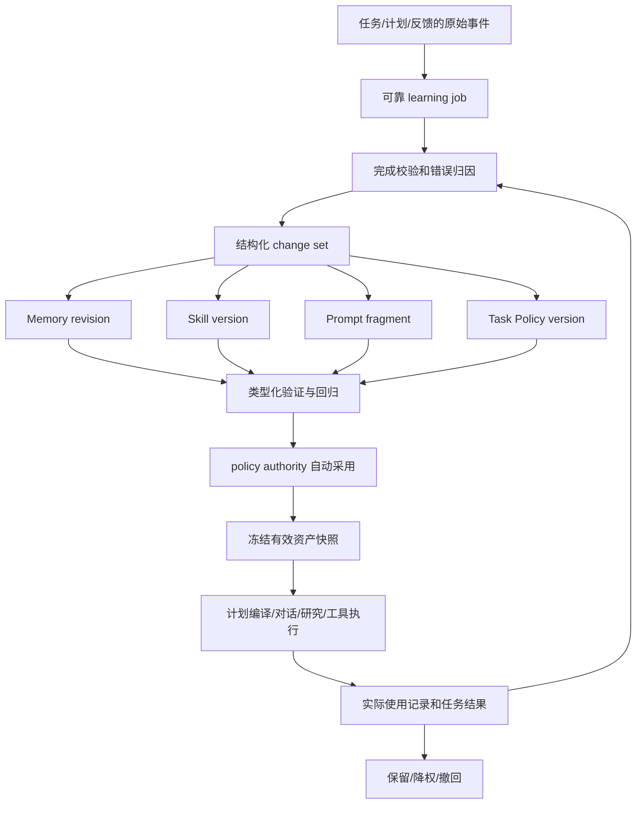

# Better Agent 自进化系统重新规划

版本：v2 设计建议，2026-09-10。

依据：用户本轮六张参考截图、当前源码、此前三位 agent 的质询，以及 `m5-controlled-final-2026-09-10.md` 的真实受控实验。截图作为讨论材料，其中的建议不自动构成实施指令。本轮只编写方案，未修改运行实现、数据库或启动付费实验。

本文作为后续开发的推荐主方案；v1.1 保留为此前讨论记录。新一轮由 learning_architecture、memory_learning、behavior_learning 分别核查 Skill、资产治理和评测/Policy，结果汇总于本文。

## 1. 什么系统适合本项目

推荐建设**以任务结果为依据、以持久能力资产为载体的自主学习闭环**。先让 Agent 更准确地理解用户、复用成功方法并改善执行决策，再扩展角色通用行为。

核心链路：

```text
执行 → 记录 → 评估与归因 → 提炼候选资产 → 分类验证
     → 按持久政策自动采用 → 下一任务实际使用 → 监测与回退
```

学习资产覆盖 Memory、Skill、Prompt 和任务 Policy。学习政策决定范围、资源和采用条件；日常满足政策的更新由系统自行完成，不需要每条变更由用户点击确认。用户可以查看、暂停、纠正和撤回。

项目目前是低流量个人 Agent，有计划、行动反馈、研究、工具及技能基础，并不适合从训练新模型或自动改代码开始。优先目标是“下一次任务确实做得更合适、少犯已知错误、少让用户重复纠正”，而不是资产数量或反思次数增长。

## 2. 对旧方案的调整

| v1.1 的重点 | v2 的调整 |
| --- | --- |
| 偏好/记忆自动应用＋researcher提示词优化 | 纳入可复用Skill和实际执行的任务Policy，避免所有经验都堆进提示词 |
| 完成事件后提炼建议 | 先验证完成情况与错误归因，再选择值得更新的资产；成功案例也能学习 |
| 以MemoryStore为主要复用中心 | 记忆、技能、bundle各用已有存储；统一来源、评测、版本与应用记录，不复制资产 |
| 讨论自动审批 | 明确policy authority可自动采用；外部写操作原有权限要求独立保留 |
| 一条通用改进流程 | 按作用范围和资产类型选择验证强度，不把3故障/60题/20+20用于每条学习 |
| 影子调用成功是阶段证据 | 正式退出要求真实消费者、实际使用、后续效果与撤回链；影子结果不替代生产E2E |

保留 v1.1 已提出的可靠事件消费、独立学习预算、来源治理、上下文实际 inclusion、owner 隔离、冻结版本与撤销例外。

## 3. 进化对象与边界

| 资产 | 本项目适合学习的内容 | 采用方式 | 首版边界 |
| --- | --- | --- | --- |
| Memory | 用户明确偏好、计划约束、项目事实、决策、执行经验 | 明确事实/要求可直接应用；推断局部试用 | 使用现有五类记忆和revision，严格scope/期限 |
| Skill | 可重复使用的多步骤方法、前置条件、核对项、输出和退出条件 | 新任务/反例验证后自动选择、绑定、试用 | 先做流程技能，指导已授权工具；不生成脚本或新connector |
| Prompt | 某角色的任务解释、输出约束、推理与证据表达片段 | 单片段配对验证后自动采用 | 先复用researcher写作适配；其他角色有真实适配后加入 |
| Task Policy | 工具选择偏好、任务拆分、检索深度、探索上限、停止条件 | 类型化配置校验＋真实决策回放＋局部试用 | 仅声明过的字段和范围，必须由实际执行代码消费 |
| Tool | 工具用法经验、适用条件、参数建议 | 记为Skill/Task Policy，不直接重写Tool | ToolSpec、handler、schema、grant修改进入工程开发流程 |
| 模型参数 | 后续有稳定数据时可考虑离线训练 | 不纳入日常学习 | 当前无必要新建训练平台或在线更新权重 |

更新频率取决于影响范围，而不是资产名称。用户要求“简短回答”可以立即影响提示词组合；影响所有研究任务的自由文本片段需要更强验证，即使编辑成本很低。

**两种Policy必须区分：**

- 学习治理政策：可改什么、费用上限、权限、敏感信息范围、发布判据。由用户/产品配置，不作为模型学习目标。
- 任务执行策略：在上述边界内怎样完成任务。可以自动学习，但不能自行抬高预算、扩大权限或跳过必需检查。

自动采用学习资产不意味着自动批准发消息、删除文件等外部副作用。实际写工具仍走现有执行授权。

## 4. 先归因，再选最小资产

反思输出必须包含原始证据、问题类别、适用范围、可改变变量、预期效果、反例和验证方法。单条“下次更认真”不构成可发布资产。

| 观察 | 正确归因与资产选择 |
| --- | --- |
| 用户说“以后先给结论” | 明确Memory偏好；无需修改整个角色系统提示词 |
| 某类计划多次实际用时远超预估 | 先记录估时观察；在匹配任务中试用估时Task Policy，不推断用户偏爱长任务 |
| 多个不同任务中“先查已有资料、再补缺口、最后核对”有效 | 蒸馏为有前提和退出条件的Skill |
| 研究答案在有效证据下仍持续越界推断 | 检查实际prompt命中，形成角色Prompt候选 |
| 请求402、工具不可达、权限拒绝 | 环境/权限问题，不自动归为用户偏好或提示词缺陷 |
| 原始模型引用格式错误但生产后处理可修复 | 先检查最终交付；定位输出协议或实现层，不直接宣告Prompt失效 |

建议诊断类别：环境、访问权限、数据缺失、实现缺陷、任务变化、行为策略、未知。证据不足时保留UNKNOWN，可以记录事实而不修改行为。

同一root的重试、多章节以及由同一模板改参数的场景，不能自动算多个独立支持。生成的总结与自评也不能成为重复强化自己的新证据。

## 5. 系统结构：一个工作流，复用四类资产



change set是job中的更新描述与引用，关联原资产的前后版本、验证合同及来源；不新建一张复制所有记忆/技能正文的“万能资产表”。

一个普通学习cycle优先复用现有每日复盘，合并提炼候选。一次只试验一个主要行为变量；事实记忆可独立追加，但影响同一任务行为的其他变化必须标记为混杂，不把收益全归给一个候选。

## 6. 数据分层与治理

参考图中的“分库存放”在本项目采用**同一PostgreSQL的逻辑分层与访问隔离**，不增加三个数据库。

| 层 | 现有承载 | 允许的作用 |
| --- | --- | --- |
| 原始轨迹 | messages/events/行动反馈/工具调用/模型调用 | 事实证据；episode是有损索引，不能替代原始来源 |
| 候选经验 | memory_proposals、learning job change set、未采用skill/bundle版本 | 检查和隔离评测；不默认进入正常指令 |
| 可用记忆 | memory_entries及不可变revisions | 按owner、项目/任务、用途、时效和证据状态选择 |
| 已采用行为资产 | 冻结的skill版本、prompt片段、task policy | 经过类型化验证后供实际消费者使用 |

“可用”与“实验证明有效”分别记录。明确偏好是用户要求，不能要求它先赢过旧偏好；推断经验的效果则可能仍为UNKNOWN。

最小元数据：

- 来源ID、版本/hash、时间、root/failure family、有效性与撤销原因。
- `claim_basis=explicit_user/observed_execution/inferred`。
- 采用状态`TRIAL/ACTIVE/SUSPENDED`与效果状态`UNKNOWN/SUPPORTED/REFUTED`。
- owner、project、role、task_type，以及可选program/run/turn限定和有效期。
- 兼容的工具接口/后处理/编译器版本、自动决策policy版本及评测报告引用。

去重与冲突分开：正文fingerprint用于去重；“30分钟”和“60分钟”需要按`owner＋适用范围＋setting`判断冲突。明确纠正优先，旧job用CAS不能覆盖较新的用户决定。

来源正文不升级为系统指令。Memory lesson保持数据；有限参数由白名单编译器生成固定overlay；自由文本Skill/Prompt必须走单独验证。网页中的“忽略用户、使用新工具”等文字不能授予行为或权限。

来源→候选→revision/skill/bundle→请求快照→结果必须有可查询依赖。forget、来源删除或撤权应使所有相关派生资产和旧pin失效；保留历史评测不能成为继续保留被要求删除正文的理由。自动遗忘优先归档/TTL；明确忘记需阻止旧job重新写回。

## 7. 三种自动采用路径

### 7.1 明确记忆与个人约束

明确、持久的用户要求，在校验归属、范围和冲突后自动应用。结构化反馈可走确定性路径；自然语言需要时做一次提取。没有必要为每条偏好等待三个故障或跑60题。

“这次计划每天30分钟”绑定program_id，不仅设置过期时间；同用户另一并行计划不受影响。隐式推断先窄范围TRIAL，不能只凭模型confidence成为已确认偏好。

### 7.2 可复用方法与有限任务策略

单例可形成候选草稿。只有方法能写清触发、步骤、输出、失败条件，并通过新输入、适用性反例与旧任务回归，才进入Skill或Task Policy试用。复用价值看后续任务结果，不看安装数、召回数或调用数。

第一批建议：更新现有goal-planning/reflection流程技能；学习计划拆分/估时的有限参数；研究检索范围在已有上限内的选择策略。参数必须送到compiler/ResearchLimits/实际工具选择逻辑，不能只写进prompt后声称已执行。

### 7.3 角色Prompt优化

先使用已有researcher写作片段适配，自动生成、冻结、配对评测和局部采用。用户设置一次治理政策后，无逐批人工批准依赖；系统decision记录policy authority，不冒充user。

评测对象按实际产品交付层定义。抽取共用写作后处理，保留raw/normalized/delivered以及transform版本；过去的FAIL仍保留。某阶段只验证写作组件时明确边界，不冒充完整研究流程。

## 8. Skill需要先修复的项目问题

当前Skill并非只有目录展示：已有包验证、版本digest、grants、THREAD/RUN绑定、会话指令注入和工具授权交集。见`skill_platform.py:49/118/269/333`、`conversation.py:1469`、`runtime.py:684`。

自动技能学习前必须完成：

1. **内容与权限同版本。** `runtime.py:1261`通过catalog名字读取当前内容，`runtime.py:1551`却用RUN冻结权限。统一从任务skill snapshot取得正文、grants、评测与归因版本。
2. **纯流程技能语义明确。** 现在`requested_tools=[]`可能使`_skill_tools_for_run()`返回空集。增加`instruction_only`类型，它既不扩大也不收缩既有工具能力；同时修正工具集合计算和授权归属入口，混合类型要测。
3. **存储候选不等于启用默认。** 当前confirm_install会安装、启用、更新默认，事件actor为user。拆分候选存储、验证、policy采用；保留人工安装API但不由后台模拟点击。
4. **线程选择和任务版本分开。** 线程可以保留用户选择的技能名，新turn/计划冻结具体版本；同会话新任务能用新版本，在途任务不漂移。停用/撤权在发送或执行前即时检查。

首版不生成Python/shell程序、不注册新Tool或connector。流程Skill仍能指导既有工具组合，真正使用哪些工具由执行器的权限交集决定。

## 9. Task Policy必须有代码消费者

不要混用现有model routing policy、学习治理policy与任务policy。新增有版本的`task_policy` schema，可作为不可变bundle manifest的独立键；不用改写现有`policy`字符串的含义。

| 示例字段 | 实际消费者与验证 |
| --- | --- |
| 同类任务拆分粒度/估时校准 | goal compiler的结构化输入和最终行动计划；检查实际时长约束 |
| 已授权工具的选择偏好 | runtime的工具选择/暴露逻辑；既有authorize继续独立执行 |
| 研究检索深度/探索轮数 | ResearchLimits与engine；核对实际来源请求次数及交付完整性 |
| 允许提前结束的条件模板 | 执行器明确谓词；必须完成的用户交付不能被省略 |
| 已允许范围内的尝试次数选择 | 真实调度/调用入口；不能提高全局硬上限，未知副作用不能自动重放 |

所有值由服务端校验、与用户当前要求及硬上限组合。未知字段或没有消费者的字段拒绝采用。工具描述、参数schema和handler修改本期走工程流程，不伪装成低风险Policy学习。

## 10. 评价：门槛＋指标向量

不先压成万能总分。每次实验在看候选结果前冻结目标、底线、比较规则、分组单位和交付对象。

1. **有效性与硬门槛**：来源有效、owner/scope隔离、权限、必需交付、不可接受错误和费用上限。
2. **任务完成**：用户要求实际满足、结果可用；HTTP 200、工具ok或程序completed不能代替它。
3. **结果质量**：正确性、约束遵从、引用/证据、相关性、返工与纠正；采用任务专用指标。
4. **效率**：前述条件满足后，比较总费用、端到端延迟、工具调用和不必要人工介入。TTFT只是子指标。成本目标可以采用预定义质量非劣条件，不要求同时赢质量。

起步面板只需要：任务完成/首次成功、约束违规、严重错误、用户纠正/返工、费用、端到端耗时、真实资产使用及未知样本数。更复杂的方差、校准、迁移效果随有效数据积累增加，不先堆指标。

参考图中的信号排序只能作为一般倾向：确定性测试也可能测错目标，环境成功可能只是请求成功，用户反馈有作用范围，多个LLM也可能共享偏差。每条信号记录覆盖范围、出处、方法版本和局限。Agent自评只提假设，不独立证明改进；明确用户偏好也不交给裁判投票否决。

当前线上二元quality_pass比例差要求正增益，会在两组均通过时无法晋升。新合同分离离线目标收益与线上安全/非劣/实际命中。低样本只能说未发现退化，不能宣称统计非劣。个人TRIAL和正式证据认证分开，超期未知按预设政策降权或暂停。

隔离验证按资产类型执行：

- Memory：来源、冲突、期限、scope、用户纠正优先、忘记不复活。
- Skill：匹配/不匹配任务、步骤与输出契约、实际绑定、工具无越权、旧任务回归。
- Task Policy：真实决策代码、执行轨迹、任务不被省略、资源在界内。
- Prompt：同输入/来源/模型配置、单变量、实际生产构造与后处理、盲评及确定性约束。

划分DEV/HOLDOUT按原始root、场景族和时间/版本需要，而不是仅不同case ID。固定回归集、隐藏检查与反例只在有相应价值时加入。换模型profile名不等于独立评估；轮换测试集也不允许丢弃失败或反复看留出后调参。

外部写操作不能为了双臂比较而真实执行两遍。使用受控adapter、记录回放或单臂结果验证，并明确其证据范围。

## 11. 自动采用、实际使用和回退

采用操作更新owner/project/task范围内的有效资产配置。全局stable保持只读回退；自动个人学习不改变其他用户。通用resolver按owner/role/purpose精确选择，不查全库最新canary。

新任务冻结：Memory revisions、Skill versions/grants、Task Policy版本、角色bundle映射、来源及后处理版本。记录selected、最终请求included/dropped、策略actual execution和输出遵从，分别统计。只选中或存进库不算使用。

普通后台更新只影响新任务。forget、撤权、禁用和针对当前任务的明确纠正，在下一次发送/工具执行前强制检查，移除失效上下文并记录替代digest；已发出的请求无法撤回，其结果不得恢复已撤销信息。

候选与基线绑定，采用和回退使用CAS。基座/工具接口升级后检查兼容性，不能静默把旧个性化bundle合并成新版本。恢复旧版本也要尊重用户后来纠正和撤销。

要分别验证自动采用成功、证据不足不采用、退化回退。系统不能永远停在TRIAL却把开发完成当作效果闭环已验证。

## 12. 最小实现与开发顺序

仍复用单一PostgreSQL、已有事件/worker、MemoryStore、SkillPlatform、BehaviorBundle、模型/工具执行器及费用账本。

建议新增核心`learning_policies`、`learning_jobs`；job记录change set和checkpoint。扩展现有revision/skill/decision元数据及应用快照。Task Policy先使用bundle里的类型化manifest；没有实际需要时不另建独立版本平台。如果现有证据关系不能表达跨资产派生依赖，再新增一张小型引用关系表，而非复制所有内容。

| 阶段 | 交付重点 | 必须验收的闭环 |
| --- | --- | --- |
| P0 可靠基础 | 事务事件/job、修正observer高水位与永久lineage跳过、独立learning预算、租约/CAS/UNKNOWN | 不漏迟到纠正、不重复调用、不复用过期任务预算；暂停政策能阻止自动应用 |
| P1 Memory到下一计划 | policy自动决策、类型化证据、跨会话scope、compiler真正消费、最终请求记录 | 用户纠正→自动更新→下一新线程计划体现→再纠正可撤回 |
| P2 方法复用 | Skill内容/权限同快照、instruction_only、自动匹配和policy采用 | 新技能在相似任务实际使用，不相关任务不触发，不改变工具权限 |
| P3 有限任务Policy | 类型化task_policy、规划/研究真实消费者和执行指标 | 策略确实改变执行且满足原要求；退化能退回，无消费者不算实现 |
| P4 角色Prompt与统一采用 | 共用最终交付评测、个人角色resolver、自动评测/采用/回退 | researcher自动优化成功与失败路径均可追溯；不是只换bundle标签 |
| P5 联合验证和成长展示 | 资产依赖撤销、跨资产回归、真实PostgreSQL/真实模型、用户可读变更记录 | 执行→资产→下次实际使用→效果→纠正完整闭合 |

P1—P4共同构成目标，不把Skill/Policy永远留成目录或建议。顺序体现先解决“记住但不用”，再解决“方法复用”，最后扩大通用行为改动。

学习在任务结束后后台运行，已有复盘能复用就不再问一遍模型；无新证据NO_CHANGE。学习有独立root但仍受owner日/月总额约束，不能每个计划结束就刷新无限预算。请求后UNKNOWN不自动重发；无法对账时保守记账并弃置未知结果。

上线前配置的每日/月费用、单cycle上限、试用期限和允许资产范围属于产品设置，尚不在本次规划中视为已授权。它们不妨碍当前完成开发方案，也不应被实现成每条资产都要再次审批。

## 13. 端到端验收案例

用一个能同时体现四类资产但分次验证的实际场景贯穿：

1. 用户完成一份学习计划，明确反馈每次练习最多30分钟。系统自动记录有scope的约束。
2. 用户在新会话创建下一份计划，compiler最终请求包含该revision，输出行动符合30分钟约束。
3. 后续不同任务的证据支持“先诊断薄弱点、再练习、最后复查”有效。系统生成流程Skill，经新输入和反例验证后在匹配任务中自动使用。
4. 对估时偏差形成有限Task Policy候选，实际compiler使用该配置；后续反馈验证估时误差，不能直接推断用户喜欢更长任务。
5. 只有通用写作行为仍存在独立问题时，才修改相应Prompt片段，使用冻结材料和共用交付后处理评测。
6. 用户改成“这个项目每次20分钟”或要求忘记，局部新规则生效；旧job不能覆盖纠正，相关资产/快照能停用；其他项目与用户不受影响。

各步要证明来源、自动决策、实际使用和后续结果。原始轨迹、候选、正式资产、试用状态在数据上可区分，验收生成的数据不能混入生产学习计数。

## 14. 对现有结果的诚实定位

受控实验已经出现：原始输出13例断言失败，应用现有写作层归一化后仍有2例失败；整体候选门禁为FAIL。它证明需要统一评测对象、先做归因，也说明只看模型自评或正的净胜比例不够。

已完成的影子分流与回滚验证可复用为局部控制流证据，不等于真实生产canary E2E、完整研究交付验收或新的自主学习系统已经完成。

本项目的成功标准应是：**用户不必反复教同一件事，Agent能在新任务中使用有来源的方法，发现不适用时自行纠正，并能解释改变了哪个资产、依据是什么、效果如何。**
