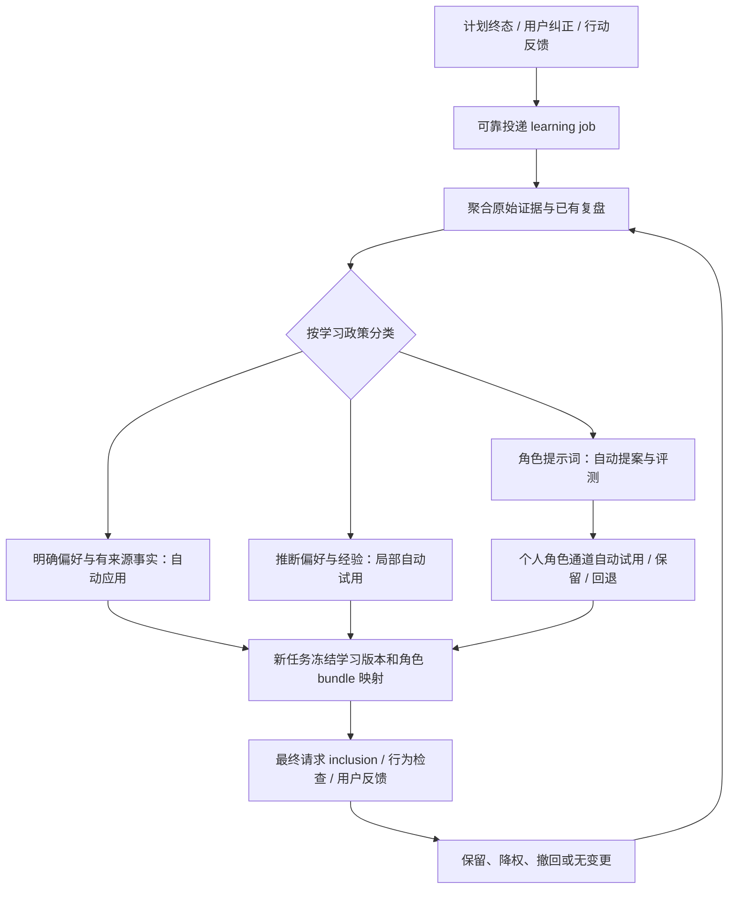

# Better Agent 自主学习闭环开发方案

版本：讨论稿 v1.1，2026-09-10；已按草案复审意见修订。

状态：三位 agent 已完成源码研究及交叉质询，主 agent 汇总建议；等待用户确认默认学习政策。本文不是实施完成、生产验收或新增付费批次授权。此次仅研究与编写方案，没有修改运行代码或数据库。

## 1. 目标与产品边界

用户已明确：计划结束后，系统应自动更新对用户偏好的理解、长期记忆和提示词行为，在后续任务中实际使用，并根据效果自行纠正；日常流程不能依赖逐条人工审批。

推荐交付一个完整自主工作流：



每次结束都执行学习检查，但允许 `NO_CHANGE`。没有新信息时不强行修改；没有反馈时记录效果未知。

“自动角色提示词优化”首版作用于当前 owner 的角色通道。全局 stable 是只读基座回退，不因某一个用户的学习而改变其他用户。工具权限、凭据、预算上限和学习政策本身不作为模型可修改的学习目标。

## 2. Grilling 设计树

```text
自主学习闭环
├─ 已由用户确定：计划结束后自动学习；覆盖偏好、记忆、提示词；无需逐条批准
├─ 第一轮前沿：确认默认自动生效政策包
│  ├─ 推荐：明确持久偏好直接生效，明确通用表达可跨项目
│  ├─ 推荐：推断偏好/lesson只在匹配项目和任务类型试用
│  ├─ 推荐：个人角色prompt经自动验证后自动生效，无人工批准依赖
│  ├─ 推荐：普通更新只影响新任务；忘记、撤权和当前任务明确纠正可强制替代
│  └─ 推荐：无效果证据不奖励；试用到期降权/暂停
├─ 上述范围确定后：预算、试用有效期、通知频率与敏感信息范围
│  ├─ 每日/月费用和调用总额；每cycle额度与截止时间
│  ├─ 推断试用期限；到期无反馈的处置
│  └─ 敏感信息仅按用户明确要求保存，不从行为自动推断沉淀
└─ 政策确认后：冻结实现契约和验收用例，开始开发
```

推荐值是产品建议，不是用户已经批准的设置。每日自动学习金额、试用期限等尚未确定；不把历史一次性验收预算转换成永久后台消费授权。

## 3. 已核实的源码基础与缺口

行号对应研究时的工作树，开发后应更新。

| 事实 | 代码位置 | 对方案的影响 |
| --- | --- | --- |
| 计划完成事务保存episode并发布program.completed | `backend/app/goal_programs.py:430` | 复用终态事件；不另造消息中间件 |
| 完成摘要是project_id=NULL、thread-only | `backend/app/goal_programs.py:458` | 当前不会自然影响新会话；必须明确跨会话作用域 |
| 每日复盘已有行动状态、预计/实际耗时、难度及调整建议 | `backend/app/goal_reviews.py:71`、`:304` | 学习优先消费已有复盘，避免重复调用模型 |
| observer先读取sources、后取高水位，且已有lineage会永久跳过 | `backend/app/experience_observer.py:43`、`:63` | 存在并发漏采和迟到纠正被遗漏的问题，不能直接当可靠学习队列 |
| 复盘调用继承最初source turn的root budget | `backend/app/goal_programs.py:515` | 数日后预算可能已过期；需要独立learning root |
| MemoryStore已支持五类记忆、revision、来源、CAS与撤回 | `backend/app/memory_v2.py:19`、`:253`、`:313` | 不新建第二套记忆数据库 |
| 现有反思仅提议ADD preference/constraint | `backend/app/runtime.py:802` | 需扩展到类型明确的更新、经验与归档 |
| 记忆证据仅接收有限类型且要求原始actor=user | `backend/app/memory_v2.py:928` | 扩展goal feedback和执行事件证据；不能伪装成用户陈述 |
| 接受提案写死user-confirmed-model / user | `backend/app/memory_v2.py:620`、`:640`、`:660` | 增加policy authority，禁止后台模拟人工点击 |
| 长期记忆渲染统一标confirmed | `backend/app/memory_v2.py:1305`、`backend/app/conversation.py:1514` | 自动推断加入后必须同步修改信任语义 |
| goal compiler没有真正接入MemoryContextProvider | `backend/app/goal_program_compiler.py:82`、`:112` | 写入记忆不等于下一计划使用，是首个闭环验收重点 |
| memory pin只证明选中，预算打包还会裁剪 | `backend/app/memory_v2.py:1431`、`backend/app/conversation.py:1518` | 分开记录selected、included、行为遵从 |
| researcher评测原始text，生产另有归一化、引用渲染和审计 | `backend/app/real_evaluation.py:96`、`backend/app/research/live.py:177`、`backend/app/research/engine.py:216` | 必须统一评测交付对象，不能直接拿原始格式错误判生产失败 |
| 线上要求两个quality_pass比例差的区间下界为正 | `backend/app/evolution.py:1181` | 双方全通过时仍无法晋升，需拆分收益与线上底线 |
| 当前stable为全局；canary先查全库最新ACTIVE再匹配 | `backend/app/evolution.py:968` | 自动化前必须改为owner/role/purpose精确寻址 |
| 正式运行要求PostgreSQL，已有请求前预算预留 | `backend/app/startup.py:94`、`backend/app/costs.py:323` | 测试可用内存，但正式数据库路径必须另验 |

## 4. 三位 agent 的交叉质询记录

参与者：`/root/learning_architecture`、`/root/memory_learning`、`/root/behavior_learning`。首次研究因模型服务503中断；恢复后沿用已有发现继续讨论，没有伪造丢失的评审结论。

这些是不同评审上下文的工程意见，不是三个独立模型的实证证明，也不等于用户确认。

| 轮次与质询 | 讨论形成的建议 |
| --- | --- |
| 第一轮，架构：事件存在就等于可靠消费吗？ | 不等于。终态事务直接投递job；历史补采使用有界扫描与事务游标，不沿用现有高水位时序 |
| 第二轮，架构问记忆：自动接受后，新线程凭什么召回？ | 完成episode保留原边界；提炼有作用域的记忆，接入compiler，并检查最终请求是否包含具体revision |
| 第二轮，记忆问行为：三次跳过怎么能证明不喜欢？ | 不能。记录行为事实；推断只进入局部试用，不升级成用户明确偏好 |
| 第二轮，记忆问架构：迟到job会覆盖刚刚纠正的偏好吗？ | 应用时重验当前纠正与来源，revision CAS；冲突可重新合并或NO_CHANGE，不强制覆盖 |
| 第二轮，行为问评测：两组都通过，为什么仍要求二元分数正增益？ | 离线目标收益与线上安全/非劣分开；低样本线上只能称未发现退化 |
| 第二轮，架构问预算：源计划结束，学习是不是拿到无限新额度？ | learning是独立核算根，仍共享owner日/月总额，不刷新总预算 |
| 第二轮，行为问归因：偏好、记忆、prompt一起变，收益归谁？ | 事实可独立写入；同scope同时只试用一个推断行为改动，记录完整effective context，混杂样本不计净收益 |
| 第三轮，主agent问记忆：lesson是不可信数据，怎能升级为系统指令？ | lesson正文保持数据；仅白名单结构化字段由确定性编译器生成固定overlay，自由文本行为修改走M5 |
| 第三轮，主agent问行为：全局stable会不会让一个用户的学习影响所有人？ | 使用owner/role/purpose通道和统一resolver；子调用继承冻结的角色映射，不动态读最新全局指针 |
| 草案复审，三位共同指出：冻结在途上下文与忘记/撤权是否冲突？ | 普通学习更新保持冻结；强制撤销及指向当前任务的用户纠正，在下一次发送前重验并记录明确替代，不能继续发送已撤销内容 |
| 草案复审，记忆指出：“本次”如何在并行计划间隔离？ | applicability必须带可选program/run/turn标识，由检索与编译器强制匹配，不能仅依赖TTL |
| 草案复审，架构指出：固定policy版本是否变成永久授权？ | 请求前、提交前、晋升前复验当前policy；暂停后停止新调用和自动应用，保留已发生费用 |
| 草案复审，行为指出：做到永远TRIAL能算闭环完成吗？ | 退出标准同时包含自动晋升成功、不足时不晋升及退化回退；真实效果无证据必须保留未验收 |

有一项实际分歧：架构倾向先交付个人记忆闭环，行为评审强调最终产品必须包含自动角色prompt优化。综合方案将两者都纳入交付范围，按阶段验收：先闭合个人学习，再接通现有researcher写作片段的自动优化；不会把提示词优化永久留作人工提案。

## 5. 可靠触发与学习工作流

### 5.1 触发

- `program.completed`、明确用户纠正是主要入口。
- cancelled、compile_failed和行动反馈同样可提供信息，但必须区分用户选择、工程故障与模型行为问题。
- 每日复盘作为证据补充，合并同一计划短时间内的事件。
- 学习服务自己的日志、总结、试用评价不能递归触发“自我学习自己”，也不能当新的独立用户证据。

新生产者在原事务中插入learning job，job即可靠投递记录；无需额外outbox服务。补采器按事件表固定高水位范围分页扫描，在同事务提交job和cursor。

### 5.2 身份与状态

原始触发使用唯一键 `(owner_id, source_event_id, policy_version)`。聚合学习cycle另绑定source aggregate、evidence revision/hash，允许迟到反馈成为新证据版本；不能按整个lineage永久去重。

建议状态：`QUEUED → RUNNING → APPLIED | NO_CHANGE | DEFERRED | FAILED | UNKNOWN`。job内checkpoint区分证据提取、变更准备和应用。worker租约加lease_epoch，防止过期worker提交。

`DEFERRED`用于预算不足、等待已有复盘或证据暂不充分；记录原因及下次允许检查时间，不轮询调用模型。

固定policy_version用于审计，不是永久执行许可。在每次模型请求前、变更提交前、角色晋升前，复验当前policy的enabled、允许范围和撤销状态。暂停后未发送工作转DEFERRED；已发送请求可以结算，但结果不能继续自动应用。预算下调必须计入已结算费用和未结算预留，不能创建新root绕开占用。恢复时复验来源与现行政策后使用有效checkpoint，不盲目重做调用。

请求发送后、结果落库前崩溃记UNKNOWN。优先按provider能力自动对账；无法对账则保留预留或按上界结算，当前未知输出不应用、不自动重放。不能更换幂等键将同一请求包装成新cycle。未来新增原始证据可以启动新的cycle。

## 6. 偏好、事实与经验的自动决策

### 6.1 证据和主张分别建模

保留现有证据有效性，增加：

- `claim_basis`: `explicit_user / observed_execution / inferred`。
- `adoption_state`: `TRIAL / ACTIVE / SUSPENDED`，与既有ACTIVE/ARCHIVED等存储状态区分。
- `effect_status`: `UNKNOWN / SUPPORTED / REFUTED`；ACTIVE不代表已证明有收益。
- `decision_actor`、`policy_version`、适用role/task_type、可选valid_until。
- `applicability_json`可含`program_id`、`run_id`或`turn_id`，用于“本次计划/本次任务”的精确限定；不匹配时不得检索或编译。不能用TTL代替对象隔离。

模型confidence仅供诊断，不能独立授权自动生效。

扩展证据解析器支持原始goal feedback和goal program event，校验owner、对象、源状态和事件版本。执行数据可以支持“耗时观察”“项目事实”“lesson”，不能直接支持“用户喜欢某事”。复盘与episode可帮助理解，但最终主张必须回指原始来源。

### 6.2 推荐应用规则

| 情形 | 自动动作 |
| --- | --- |
| 用户明确“以后回答简洁一些” | 保存明确偏好，在相应通用范围ACTIVE |
| 用户明确“这次每天只安排30分钟” | 限定本计划/期限，不升级全局 |
| 多次同类任务实际耗时高于预计 | 形成估时lesson，局部试用校准，不推断用户喜欢长任务 |
| 计划完成了全部行动 | 保存完成事实，不写“用户满意”或“方案有效” |
| 明确纠正与旧推断冲突 | 新纠正优先，停用相关推断；保留版本和来源 |
| “忘记这件事/以后别再记” | 撤销记忆及派生上下文，并保留不含正文的suppression标记，阻止旧job复活 |
| 没有新证据 | NO_CHANGE；不重复强化自己的总结 |

人工`decide_proposal()`保持原语义。新增服务内部`apply_under_policy()`，共用校验和事务提交，但明确记录learning-policy authority。客户端不能通过自由传actor绕过检查。

### 6.3 经验到个性化规则

复用 `kind=lesson` 和revision；不新增平行规则库。增加可选：

```json
{"role":"planner","task_type":"study","setting":"session_minutes","value":30}
```

服务端验证setting白名单、类型、取值和适用范围，确定性编译为固定措辞。原始lesson正文始终是不可信数据，不能直接拼进系统指令。白名单外的经验可作为检索资料；自由文本的通用行为改动进入版本化M5流程。

明确当前要求优先于历史偏好；明确偏好优先于推断。跨项目的默认推荐是：明确通用偏好可跨项目，事实与推断lesson先限于原项目/任务类型。

## 7. 下一任务真正使用与效果回流

统一接入新计划编译、计划调整、普通回复和research的真实messages构造。优先接通goal compiler，这是计划后学习能否产生下一次效果的关键。

复用memory context pins，但必须固定读取对应revision，不能再重读current revision。任务开始时冻结memory revisions、规则版本及owner角色bundle映射；子调用继承该映射。普通后台学习不会令在途任务悄然切换版本。

冻结不豁免撤销：每次新模型调用前重验forget、源删除、撤权和禁用清单。失效条目必须移除后重新构造允许上下文，或终止该次调用；记录原snapshot、替代原因和新的effective digest。用户明确纠正且指向当前任务时，同样在尚未发送的调用中显式更新，不静默读取任意最新记忆。已经发出的请求无法撤回，其结果不得重新沉淀被撤销的信息。这个例外不授权后台自行改写正在执行的计划结构。

三层证据分开记录：

1. `selected`：检索器选中。
2. `included/dropped`：实际请求打包、裁剪后是否还存在，并记录drop_reason。
3. `followed/violated/unknown`：实际输出或执行是否遵从；用户反馈是否支持该改动。

只有included条目进入归因。明确约束需要语义相关的必需检索/上下文预留，不能只靠关键词命中；预算不足要可解释，不能裁掉后仍声称已应用。

个人偏好看约束遵从和用户纠正；估时lesson看估计误差、返工和完成情况；prompt看针对目标的任务质量。用户没有反馈记UNKNOWN；完成事件、召回命中和模型自评都不等于满意。

## 8. 提示词自动优化与个人角色通道

### 8.1 首版覆盖

个人偏好/结构化经验可立即影响planner、conversation等已接入消费者。自由文本角色prompt先自动优化已有的 `researcher/write_research_section/evidence_statement`。其他角色必须先有真实适配入口和对应测试，再加入允许范围。

流程是自动提案、自动评测、自动局部试用、自动保留或回退。普通流程不调用写死actor=user的人工包装器；由policy authorizer产生带authority_kind、policy_id/version和证据摘要的系统decision。

### 8.2 通道与版本

复用runtime_channels，增加规范化的owner/role/purpose命名空间及统一resolver。顺序为匹配个人角色通道，然后全局stable回退。严禁依靠“全库最新ACTIVE canary”查找。

基线选择、分流、晋升、回滚、model_control隐式回退均调用同一resolver。父任务冻结角色→bundle映射；不能用一个父bundle代表所有角色覆盖。首次初始化owner通道必须原子完成，更新使用CAS。

个人完整bundle可能冻结旧基座配置，因此基座变化时先暂停旧候选晋升、识别差异并重新评测，不静默合并权限/路由变化。全局stable不被这条自动个人学习链修改。

### 8.3 修正评测协议

- 抽取生产共用后处理，记录raw、normalized、delivered及transform version。按预先定义的交付对象评分，不把历史raw FAIL追改成PASS。
- 目标收益由离线配对评价和实际用户信号支持；线上检查安全、任务要求、费用与适用性。
- 基线已有失败单独报告；候选新增退化和候选自身必须满足的底线分别判断，不能机械要求“基线必须完美”。
- 删除“双方quality_pass全为真仍必须从该布尔变量证明正增益”的矛盾。线上样本少时只能记录未发现退化，不能冒充统计非劣。
- 个人规则可在证据UNKNOWN时进入明确标记的局部TRIAL；通用角色自动晋升要求预先定义的收益证据。到期未知按政策暂停/降权，而非转回人工审批。
- 按原始root和failure family分组隔离DEV/HOLDOUT；不同字符串或模板参数不等于独立样本。同模型裁判只作辅助信号。
- 同一scope同时一个推断行为trial，避免多处同时改动后无法归因。新的明确用户纠正可立即覆盖试用；相关样本标混杂。

现有三故障、60题、20+20不用于每条记忆或个人约束。角色评测合同按变更风险、目标指标和证据能力版本化；具体统计阈值须先用基线验证，不能为了得到PASS而事后调整。

## 9. 最小数据与接口变更

| 对象 | 建议 |
| --- | --- |
| learning_policies（新） | owner、version、enabled、允许kind/scope/operation、试用设置、日/月/单cycle预算、通知配置、policy digest |
| learning_jobs（新） | 触发事件、source revision/hash、policy version、状态、lease owner/epoch、root budget、checkpoint、change set、错误与幂等键 |
| memory entries/revisions/proposals | 扩展claim_basis、adoption/effect state、期限、自动决策、adaptation_json及含program/run/turn限定的applicability_json；共用原证据链/CAS |
| 上下文pins/应用记录 | 绑定精确revision及最终请求included/dropped；若现有关系表不能承载，再增learning_applications小表 |
| evolution_decisions | 增authority_kind、policy_id/version；摘要、来源和CAS继续保留 |
| runtime_channels/canary | 使用owner/role/purpose地址与精确筛选，不新增第二套bundle服务 |
| root预算 | 增learning用途，配合owner日/月总预算；不复用过期源任务预算 |

建议接口：学习政策GET/PUT，learning jobs列表/详情，暂停/恢复，撤回某项变更，以及“不再学习此类信息”。沿用现有API风格与owner鉴权，不再新增每条变更必须点击的批准流程。

成长页面展示“学到了什么、来源、作用域、当前试用/生效状态、实际使用和效果”，将审批按钮降为用户主动干预。只在重要变化、撤回或需要用户选择时通知，普通NO_CHANGE不打扰。

所有schema通过Alembic增量迁移；旧记录没有新字段时按历史人工记忆/历史报告读取，不自动把模型推断升级成用户确认。不可破坏性降级、删除旧评测或改写旧FAIL。

## 10. 开发顺序与退出标准

以下阶段共同构成交付范围，不把自动prompt流程永久留作后续建议。

| 阶段 | 实现 | 退出标准 |
| --- | --- | --- |
| P0 可靠学习基础 | policy/job、事务触发、补采、独立预算、lease/CAS、UNKNOWN、可观测状态 | 并发事件不漏；重复不扣费；迟到反馈可学习；崩溃不重发；预算不足保留job |
| P1 偏好记忆闭环 | 类型化证据、policy自动应用、scope/TTL、compiler接入、最终request记录 | 真实纠正→自动写入→新线程新计划实际体现约束，无人工接受步骤 |
| P2 经验试用与反馈 | 结构化overlay、trial、效果指标、纠正撤回、suppression | 旧job不覆盖新纠正；忘记后不复活；裁掉的条目不算应用；无反馈不奖励 |
| P3 自动角色优化 | 共用交付后处理、个人角色resolver、自动authority、离线/线上判据 | 分别验证researcher片段的自动提案→评测→试用→满足合同后的自动晋升、证据不足不晋升、退化自动退回；均有CAS和重启持久性，其他owner和全局stable不受影响 |
| P4 联合验收与展示 | 成长记录、通知、真实PostgreSQL与真实模型分阶段验收 | 完整学习→应用→结果→纠正链可追溯；结果/费用/报告/退出码一致 |

源码工作面：goal_programs、goal_reviews、experience_observer、memory_v2、memory_archive、goal_program_compiler、conversation/runtime、model_control、evolution/real_evaluation、costs、startup/main，以及增量迁移、针对性测试和成长页。

## 11. 必测场景

1. 完成计划同时写事件/job；事务失败不留半条学习记录。
2. 同一事件重复投递、迟到反馈、新证据版本、多个计划并发完成。
3. 请求前崩溃可安全重领；请求后未知不重发；过期worker不能提交。
4. 自动决定没有user-confirmed伪标签；执行观察不能冒充用户偏好。
5. 当前用户明确要求覆盖旧推断；“本次”不跨项目；两个owner隔离。
6. source删除、授权撤销、forget suppression使待处理job和派生上下文失效。
7. 新线程compiler真正包含对应revision，预算裁剪产生可检查的included/dropped记录。
8. 普通更新保持冻结revision和角色映射；forget/撤权及指向当前任务的明确纠正，在后续发送前强制失效或显式替代，保留effective digest变更记录。
9. 同一scope推断trial互斥，用户新纠正不被旧rollback覆盖。
10. 两队列都表现良好时可根据已具备的离线收益和线上条件合理处置，不永远卡在二元增益门槛。
11. 两个owner并行角色试用，不互相遮蔽；首个owner通道初始化和回退正确。
12. 按当前真实PostgreSQL执行事务/CAS/预算兼容检查，再做限定真实模型测试。
13. job运行中暂停policy：停止后续请求与自动应用，已发生调用只结算；下调预算不能忽略未结算预留。
14. 同一用户并行两项计划：“这次30分钟”仅作用于所指计划，TTL未到期也不能串到另一计划。

自动晋升的控制流可先用mock验证，但真实有效收益和真实生产角色通道的成功路径不能用模拟结果替代；没有满足条件的真实候选时明确记录该项尚未验收。

离线用mock/内存对象。正式数据库检查只使用当前better_agent，数据带批次和owner，先保留脱敏证据再按明确范围处理；不新建隔离数据库/容器，不误把验收记录计入生产学习。

## 12. 现有验收证据的使用边界

`docs/acceptance/m5-controlled-final-2026-09-10.md` 记录的真实受控调用可证明模型接口、成本记录和影子分流/回滚的部分行为。它的整体候选门禁为FAIL，影子通道也没有覆盖生产canary部署端到端。

因此本方案不能以“90项测试通过”或“243次调用成功”替代新的自主闭环验收。验收重点是用户实际的下一计划是否应用正确学习，以及错误学习能否自动被纠正。

## 13. 第一轮需要用户确认的政策包

推荐默认：

- 明确持久偏好自动生效，明确通用偏好可跨项目。
- 推断偏好与经验可以自动试用，但限定项目/任务类型，效果未知不当成功。
- researcher个人角色片段经自动验证后自动生效，无逐次人工批准。
- 普通后台新版本只影响新任务；forget/撤权及指向当前任务的明确纠正，按第7节在后续调用前强制处理。
- 推断试用到期仍无支持证据时暂停/降权，用户纠正立即优先。

用户确认或调整这个政策包后，下一轮再冻结适用预算、试用期限和通知默认值；这些内容会影响任务调度、API字段和真实验收条件。此前不实施自动写入或生产行为变更。
