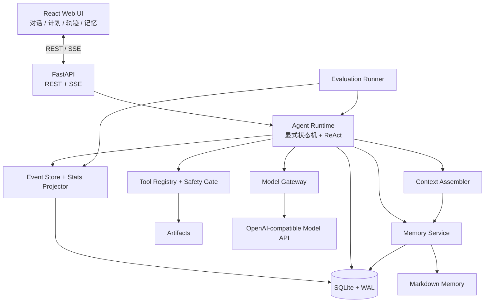
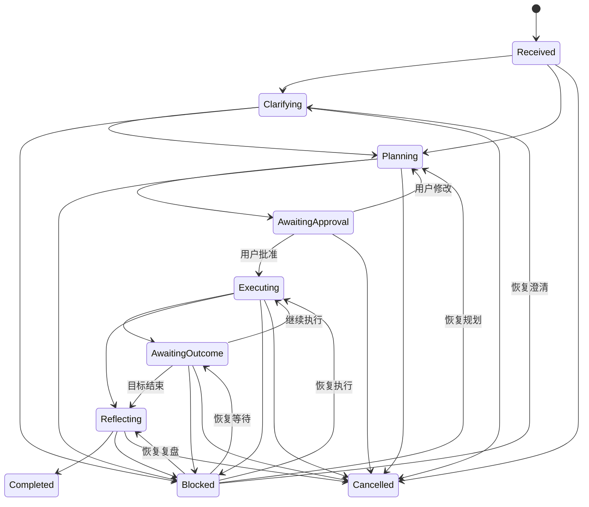

# 本地个人目标执行与反思 Agent：V1 开发设计

- 文档状态：已批准，进入实施阶段
- 日期：2026-08-17
- 产品形态：本地、单用户、状态化个人助手
- 技术基线：Python + FastAPI、React + TypeScript、SQLite + WAL、Markdown、REST + SSE

## 1. 产品定义

V1 是一个帮助用户持续推进个人目标的本地 Agent。它不是通用聊天机器人，也不是 Coding Agent；它围绕下面的闭环工作：

```text
目标 → 澄清 → 计划 → 用户批准 → 执行
→ 观察结果 → 复盘 → 更新偏好
```

系统的核心差异化不是“能调用多少工具”，而是：

1. 通过显式状态机控制执行过程。
2. 用户能随时修改计划、暂停、取消或恢复。
3. 通过多次交互积累经过确认的偏好和习惯。
4. 每次模型决策、工具调用、状态变化和记忆应用都有可审计轨迹。
5. 通过可回放轨迹和评测集验证 Agent 的正确性，而不是只展示一次 Demo。

## 2. V1 目标与非目标

### 2.1 V1 目标

- 跑通一个完整的目标执行与复盘闭环。
- 支持模型、地址和 Key 环境变量的配置。
- 使用自研薄 Runtime 实现显式状态机和 ReAct 执行循环。
- 支持用户批准计划，并在执行过程中随时调整剩余计划。
- 提供少量安全、本地、可演示的工具。
- 使用 SQLite 持久化运行状态和完整轨迹。
- 使用 Markdown 保存用户可直接查看、编辑和回滚的长期记忆。
- 提供对话、计划、轨迹和记忆四个核心页面。
- 提供确定性场景回放和小规模模型质量评测。

### 2.2 V1 非目标

- 不实现 Coding Agent。
- 不实现 RAG、Embedding 或向量数据库。
- 不实现多用户、组织、权限角色和账号体系。
- 不实现多 Agent 编排。
- 不实现工具并行执行。
- 不接入 Shell、任意网络访问、MCP 或远程 Skill 市场。
- 不引入 Redis、Celery、消息队列或微服务。
- 不做跨厂商静默模型切换。
- 不展示或保存模型隐藏思维链。
- 不实现云端遥测和分布式链路追踪。

## 3. 核心概念与计数口径

为避免“步骤”“轮次”“调用”混用，系统统一使用以下概念：

| 概念 | 定义 |
|---|---|
| Goal | 用户希望持续推进的目标 |
| Session | 围绕一个 Goal 的连续交互会话 |
| Run | 一次可以暂停、阻塞、恢复的执行实例 |
| Interaction | Runtime 接受并处理的一次用户输入 |
| PlanVersion | 一次不可变的计划版本 |
| PlanStep | 用户计划中的业务步骤 |
| ReActIteration | 执行某个 PlanStep 时的一次模型决策轮次 |
| ModelInvocation | Runtime 发起的一次逻辑模型调用 |
| ModelAttempt | 一次真实 HTTP 请求；重试会产生新的 Attempt |
| ToolCall | 一个通过 Registry、安全检查和审批流程的工具调用 |

“模型网关重试”不会增加 ReActIteration，但会增加 ModelAttempt，并计入真实 Token 和请求统计。

## 4. 总体架构



系统采用单进程部署。Agent Runtime 是唯一执行协调者；模型不能直接修改数据库、计划、记忆或文件。

所有外部动作必须经过下面的调用链：

```text
模型输出 → 结构校验 → Runtime 决策
→ ToolRegistry 精确匹配 → SafetyGate
→ 必要时用户审批 → Tool 执行 → 标准结果
```

## 5. 用户主流程

1. 用户创建目标并输入初始描述。
2. Agent 判断信息是否足够；不足时进入澄清。
3. Agent 生成结构化计划，创建 `plan_version=1`。
4. 用户批准或调整计划。
5. Agent 逐个执行计划步骤，每一步内部运行有限次 ReAct。
6. WRITE 工具在执行前逐次请求用户确认。
7. 需要现实世界结果时进入 `AwaitingOutcome`，等待用户反馈。
8. Agent 复盘目标执行情况并提出偏好或习惯候选。
9. 用户在记忆面板确认、编辑或拒绝候选。
10. 经过确认的记忆从下一原子步骤开始影响 Agent。

## 6. 模块一：模型网关

### 6.1 接口范围

V1 只实现一套 OpenAI-compatible Chat Completions 流式调用协议，不为不同厂商建立独立业务分支。模型配置使用具名 Profile：

```yaml
models:
  default:
    base_url: "https://example.com/v1"
    model: "example-model"
    api_key_env: "AGENT_MODEL_API_KEY"
    timeout_seconds: 60
    max_attempts: 4
    network_retries: 2
```

约束：

- API Key 只从环境变量读取。
- 配置文件、数据库、轨迹和前端接口均不返回 Key 原文。
- 日志只能记录 `api_key_env` 的变量名和是否已配置。
- 切换模型只影响下一次 ModelInvocation，不中断当前已发出的请求。

### 6.2 统一输入输出

网关将不同兼容实现归一化为：

- 请求参数：model、messages、tools、temperature、max_tokens、stream。
- 响应内容：assistant message、tool calls、finish reason。
- Usage：uncached input、cache read、cache write、output、reasoning subset。
- Timing：开始时间、首个非空 Token 时间、结束时间。
- Error：鉴权、限流、服务端错误、超时、上下文溢出、结构错误、用户取消。

`reasoning_tokens` 是 `output_tokens` 的辅助子字段时不得重复累加。模型隐藏推理内容不写入轨迹；流中出现 reasoning delta 时只允许记录其首个到达时间和 Token 用量。

Usage 进入统计前必须转换成互斥桶。如果 Provider 的 `input_tokens` 已包含 cached tokens，则网关归一化为 `uncached_input_tokens = max(input_tokens - cache_read_tokens, 0)`；Provider 未报告的缓存字段保持“不可用”，不能推测为真实零值。

### 6.3 重试、降级与兜底

| 故障 | V1 行为 |
|---|---|
| 429、5xx、Timeout | 默认最多重试 2 次，退避 1 秒、2 秒并加入 ±20% 抖动 |
| Context overflow | 按上下文裁剪规则缩减后重试 1 次 |
| 模型结构化输出错误 | 添加修复提示并重试 1 次 |
| 401、403、Key 缺失、配置错误 | 立即失败，不重试 |
| 用户取消 | 立即终止流，保存当前事实事件 |

每个 ModelInvocation 的所有真实请求受 `max_attempts=4` 硬上限约束。任何分类重试都不能突破该上限。

重试耗尽后：

1. 保存 Checkpoint。
2. Run 进入 `BLOCKED`。
3. 向用户展示故障类型和已消耗请求次数。
4. 用户可修改配置、手动切换模型，然后从 Checkpoint 恢复。

V1 不自动跨厂商切换模型，避免在价格、能力、隐私和输出风格不同的模型之间静默改变行为。

## 7. 模块二：上下文工程

### 7.1 上下文优先级

上下文按以下顺序组装，前面的内容具有更高保留优先级：

1. 系统安全规则和工具边界。
2. 用户最新明确指令。
3. 已确认且处于启用状态的偏好和习惯。
4. 当前 Goal、当前 PlanVersion、当前 PlanStep 和状态。
5. 当前 Skill。
6. 当前 Interaction 的最近对话历史。
7. 工具结果摘要和 Artifact 引用。

候选、已拒绝、已停用的记忆不得进入模型上下文。

### 7.2 无向量检索的记忆选择

V1 不做语义检索，按显式 Scope 选择记忆：

- `global`：所有目标可用。
- `project`：只在同一个 project_id 下使用。
- `skill`：只在对应 Skill 被激活时使用。

Scope 更具体的记忆优先于全局记忆；当前用户明确指令始终优先于历史记忆。

### 7.3 上下文超限裁剪

发生上下文溢出时按固定顺序裁剪：

1. 大型工具结果只保留摘要、Hash 和 Artifact 引用。
2. 缩短旧对话窗口，保留当前 Interaction。
3. 移除与当前 Scope 不匹配的反思记录。
4. 保留安全规则、当前目标、当前计划、当前步骤和已确认偏好。

裁剪后只重试一次。仍然超限则进入 `BLOCKED`，不能循环压缩。

### 7.4 请求快照

每次 ModelInvocation 前记录可重建的上下文快照：

- 模型 Profile 和非敏感请求参数。
- 使用的计划版本、Skill 和记忆版本。
- 上下文各区块 Token 估算。
- 消息内容或 Artifact 引用。
- 完整快照 Hash。

快照用于轨迹、调试和评测，不包含 API Key 或隐藏思维链。

## 8. 模块三：Agent 执行循环

### 8.1 显式状态机

主状态机为：



持久化层和 API 使用大写状态枚举：`RECEIVED`、`CLARIFYING`、`PLANNING`、`AWAITING_APPROVAL`、`EXECUTING`、`AWAITING_OUTCOME`、`REFLECTING`、`COMPLETED`、`BLOCKED`、`FAILED`、`CANCELLED`。`BLOCKED` 同时保存 `resume_state`，恢复时只能回到被阻塞前的合法状态。

任何非终态都可以因不可恢复的内部错误进入 `FAILED`，也可以响应用户操作进入 `CANCELLED`；图中不重复绘制这些全局转换。所有转换由 Runtime 校验，模型只能提出意图，不能直接写状态。

### 8.2 计划版本与随时调整

- 每次计划修改都创建新的不可变 `plan_version`。
- 未完成步骤允许增删改、重排。
- 已完成步骤保留在历史版本中，不重新解释。
- 用户修改计划时，当前正在运行的原子步骤默认完成后停止。
- 用户可以单独取消当前步骤，此时立即保存 Checkpoint，并由新计划决定下一步。
- 新版本默认从下一个步骤生效。
- 如果偏好修改会改变剩余计划，系统询问是否重新规划，不得静默修改。

### 8.3 ReAct 执行范围

ReAct 只存在于 `Executing` 状态的单个 PlanStep 内：

```text
读取当前观察
→ 模型给出结构化决策摘要和动作
→ 校验动作
→ 可选工具执行
→ 写入新观察
→ 完成步骤或进入下一轮
```

默认执行预算：

```yaml
runtime:
  max_react_iterations_per_step: 5
  max_step_wall_time_seconds: 300
  max_consecutive_tool_errors: 2
  max_identical_actions: 2
```

达到任一阈值后保存 Checkpoint 并进入 `BLOCKED`，向用户提供：

- 追加预算。
- 修改计划。
- 取消当前步骤。
- 结束目标。

模型网关内部重试不增加 ReActIteration，但增加 ModelAttempt、真实耗时和 Token 用量。

### 8.4 Checkpoint 与恢复

Checkpoint 至少包含：

- 当前状态。
- 当前 PlanVersion 和 PlanStep。
- 已完成步骤。
- ReActIteration 和剩余预算。
- 最近观察和 Artifact 引用。
- 待处理审批。
- 已应用记忆版本。
- 最后一个已提交事件序号。

应用启动时扫描非终态 Run。用户选择恢复后，Runtime 从最后一个已提交 Checkpoint 继续；不得重复已经成功完成的 WRITE 工具。

## 9. 模块四：工具与 Skills

### 9.1 ToolRegistry

每个工具注册：

- 唯一名称和描述。
- JSON Schema 参数。
- `PURE`、`READ` 或 `WRITE` 风险等级。
- 超时时间。
- 允许访问的工作区。
- 标准化执行函数。

调用流程：

```text
精确名称匹配
→ 参数 Schema 校验
→ Skill 允许列表校验
→ SafetyGate
→ 必要时用户审批
→ 超时和工作区检查
→ 执行
→ ToolResult
```

标准 ToolResult：

```json
{
  "ok": true,
  "summary": "面向模型的短摘要",
  "data": {},
  "artifact_ref": null,
  "error": null,
  "meta": {}
}
```

大型结果写入 Artifact，模型只接收摘要、Hash 和引用。WRITE 工具不自动重试，避免重复副作用。

### 9.2 V1 工具

- 获取本地时间。
- 安全计算器。
- 读取 Agent 工作区内的 Markdown 笔记。
- 经用户逐次确认后写入 Agent 工作区 Markdown 笔记。

V1 不提供 Shell、任意 HTTP 请求、工作区外文件访问和动态代码执行。

### 9.3 Skill 系统

Skill 目录约定：

```text
skills/<skill-name>/SKILL.md
```

SKILL.md 描述：

- 适用场景。
- 输入与输出约定。
- 执行步骤。
- 允许使用的工具。
- 失败和停止条件。

Skill 允许工具与全局 ToolRegistry 取交集，Skill 不能扩大系统权限。V1 内置两个示例：目标规划和执行复盘。

## 10. 模块五：状态与记忆

### 10.1 SQLite 的职责

SQLite 是本地单用户 V1 的正式数据库，不是一次性过渡方案。开启 WAL，并由单进程管理写入。

主要表：

- `goals`
- `sessions`
- `runs`
- `interactions`
- `plan_versions`
- `plan_steps`
- `checkpoints`
- `messages`
- `events`
- `approvals`
- `memory_candidates`
- `memory_file_versions`
- `run_stats`

数据库保存结构化状态、历史、审批、候选记忆、轨迹和统计投影。

### 10.2 双层记忆

```text
历史记忆：SQLite 中的消息、事件、计划和执行结果
长期记忆：用户可读写的本地 Markdown
```

长期记忆目录：

```text
data/memory/
├── profile.md
├── preferences.md
├── projects/<project-id>.md
├── reflections/<run-id>.md
└── .versions/<memory-path>/<version>.md
```

Markdown 是已确认长期记忆的可读事实载体。SQLite 保存候选状态、文件版本、Hash、证据事件和索引，不使用向量。

通过 UI 修改记忆时，系统先归档旧 Markdown，再原子替换当前文件。检测到用户手工修改文件时，通过 Hash 变化创建一个新版本，从而支持查看历史和回滚。

### 10.3 偏好与习惯闭环

```text
明确输入或交互证据
→ ReflectionWorker
→ PreferenceCandidate
→ 用户确认 / 编辑 / 拒绝
→ 写入长期记忆
→ 下一原子步骤应用
```

候选字段：

- `kind`：preference 或 habit。
- `content`。
- `scope`：global、project 或 skill。
- `confidence`。
- `evidence_event_ids`。
- `status`：proposed、confirmed、rejected、superseded、disabled。

规则：

- 用户明确说“记住”“以后都……”时属于直接授权，可以直接确认。
- 从行为推断出的偏好只能成为候选。
- 只有 confirmed 且未 disabled 的记忆能影响 Agent。
- 新观察不能直接覆盖已确认记忆。
- 最新明确指令优先于历史记忆。
- 每次实际使用记忆都写入 `memory.applied` 事件。

### 10.4 记忆面板

用户可以：

- 新增和编辑偏好。
- 确认、编辑或拒绝候选。
- 停用或删除记忆。
- 查看证据事件。
- 查看版本和回滚。
- 查看某条记忆在哪些运行中被应用。

运行中修改记忆从下一原子步骤开始生效，不改变正在执行的步骤。

## 11. 模块六：安全与控制

### 11.1 本地边界

- 服务只绑定 `127.0.0.1`。
- 正式构建由 FastAPI 托管前端静态资源，保持同源。
- 后端校验 Host 和 Origin，只接受回环地址与本地同源请求，防止 DNS Rebinding。
- 所有修改状态的接口要求前端携带启动时生成的 CSRF Token 和 JSON Content-Type。
- API Key、Authorization、Cookie、密码和环境变量值不得进入日志。
- 前端不能提交任意文件系统根路径。

### 11.2 工具授权

| 类型 | 默认行为 |
|---|---|
| PURE | 自动执行 |
| READ | 在 Agent 工作区内自动执行 |
| WRITE | 每次调用前请求用户确认 |

以下情况直接拒绝：

- 未注册工具。
- 参数不符合 Schema。
- Skill 未授权工具。
- 工作区外路径。
- `..` 目录穿越。
- 符号链接逃逸工作区。
- WRITE 工具没有有效审批。

审批只绑定当前 `tool_call_id`、标准化参数 Hash 和有效 Run；参数变化后必须重新审批。

### 11.3 不可信输入

模型输出、用户笔记、工具返回和 Markdown 内容都视为不可信输入。笔记中的“忽略系统规则”等文本不能获得系统指令权限。

所有批准、拒绝、取消、安全拦截和路径校验失败都写入轨迹。

## 12. 模块七：可观测性与轨迹系统

### 12.1 事件日志

借鉴 DeepSeek Harness 的 append-only typed event 与 projection 思路，`events` 是运行事实日志。每个 Run 内 `seq` 单调递增且不可修改。

事件信封：

```json
{
  "schema_version": 1,
  "event_id": "evt_xxx",
  "seq": 128,
  "run_id": "run_xxx",
  "goal_id": "goal_xxx",
  "type": "tool.execution.completed",
  "occurred_at": "2026-08-17T22:30:00+08:00",
  "actor": "tool",
  "correlation": {
    "interaction_id": "int_xxx",
    "plan_version_id": "pv_xxx",
    "plan_step_id": "ps_xxx",
    "react_iteration": 2,
    "model_invocation_id": null,
    "model_attempt_id": null,
    "tool_call_id": "call_xxx"
  },
  "data": {}
}
```

关键事件类型：

- `interaction.started` / `interaction.ended`
- `state.transitioned`
- `plan.version_created` / `plan.approved`
- `plan.step_started` / `plan.step_finished`
- `react.iteration_started` / `react.iteration_finished`
- `model.invocation_started` / `model.invocation_finished`
- `model.attempt_started` / `model.first_token` / `model.usage_updated` / `model.attempt_finished`
- `tool.proposed` / `tool.execution_started` / `tool.execution_finished`
- `approval.requested` / `approval.granted` / `approval.rejected`
- `budget.warning` / `budget.exhausted`
- `checkpoint.saved` / `run.resumed`
- `memory.candidate_created` / `memory.confirmed` / `memory.rejected` / `memory.applied`
- `run.blocked` / `run.cancelled` / `run.failed` / `run.completed`

开始和结束事件通过 Correlation ID 配对。未闭合 Span 显示为“未完成”，不得假设结束时间。

### 12.2 StatsProjector

后端从完整事件日志增量构建 `run_stats`，统计不依赖前端已加载的分页窗口，也不受上下文裁剪影响。

事件写入和投影更新在同一个 SQLite 事务中完成。投影版本变化时可以从事件日志完整重建。

顶部统计条：

```text
交互 1 次 · 计划 2/4
LLM 请求 3 次 · 4.6s
工具执行 2 次 · 5.0s
TTFT 平均 1.6s · 193 tok/s
缓存命中 50%
输入 26.3K tok · 输出 295 tok
当前状态 EXECUTING
```

指标定义：

| 指标 | 口径 |
|---|---|
| 交互次数 | `interaction.started` 数量 |
| 计划进度 | 当前 PlanVersion 已完成步骤数 / 总步骤数 |
| LLM 请求次数 | ModelAttempt 数量，包含重试 |
| LLM 时间 | 成功 ModelInvocation 从开始到最终响应的总耗时，包含内部重试等待 |
| 工具次数 | 实际进入 `tool.execution_started` 的调用数 |
| 工具时间 | 按 tool_call_id 匹配 execution started/finished 的时长 |
| TTFT | 成功流式 Attempt 从开始到第一个非空 Token Delta |
| 吞吐率 | `Σ output_tokens / Σ decode_seconds`，按 Token 加权 |
| 缓存命中率 | `cache_read / (uncached_input + cache_read + cache_write)` |
| 输入 Token | 三个互斥输入桶之和 |
| 输出 Token | Provider 报告的总输出 Token |

同一 ModelAttempt 的流式 Usage 和最终 Usage 使用替换语义，不能重复累加。缺少 Provider Usage、首 Token 或闭合事件时显示“不可用”，不能显示伪造的零值。

失败和取消的 ModelInvocation 保留独立计数和完整轨迹，但不进入正常 LLM 时间、TTFT 和吞吐率聚合；其等待时间仍包含在 Run 总耗时中。返回标准错误结果的工具属于已闭合 ToolCall，计入工具次数和工具时间；进程中断造成的未闭合 ToolCall 不计算时长。

### 12.3 轨迹页面

一级页面：

```text
对话 | 计划 | 轨迹 | 记忆
```

轨迹页面包含：

- 顶部统计条。
- Input、Context、Model、Tools、State、Memory 六条泳道。
- 时间模式和执行顺序模式。
- 按 Interaction、PlanStep 和 ReActIteration 分组。
- 按事件类型、状态和步骤筛选。
- 文本搜索。
- 参数、结果、Usage、Timing 和关联事件展开。
- SSE 实时追加。
- 断线后使用 Last-Event-ID 补发缺失事件。

### 12.4 JSONL 导出与脱敏

默认导出为脱敏 JSONL：

- 移除 Key、Authorization、Cookie、密码和环境变量值。
- 屏蔽常见 Secret 模式。
- 默认隐藏自由文本消息正文、笔记正文和工具原始参数，只保留长度、Hash、摘要和结构。
- 工作区外绝对路径替换为占位符。
- 脱敏在导出副本上执行，不修改本地事实日志。
- 脱敏器异常时终止导出，禁止回退到原文。

用户可以在本地二次确认后导出完整日志；完整导出必须在界面中明确标注可能包含私人信息。

## 13. 模块八：评测系统

V1 采用三层评测体系：

```text
确定性 Invariant
→ 确定性场景回放
→ 小规模真实模型质量评测
```

### 13.1 确定性 Invariant

直接读取轨迹验证：

- 状态转换合法。
- 未批准计划不能执行。
- WRITE 工具未经审批不能执行。
- 未确认记忆不能被应用。
- 计划修改必须创建新版本。
- ReAct 不得超过已批准预算。
- 进入执行的步骤必须有明确终态。
- event.seq 连续且唯一。
- ToolResult 必须关联有效 ToolCall。
- API Key 不得出现在事件、日志和导出中。

Invariant 由代码判断，不调用 LLM。

### 13.2 确定性场景回放

使用 MockModelGateway 和 FakeToolRegistry 固定非确定性输入。V1 提供 12 个场景：

1. 正常规划、批准和执行。
2. 信息不足时澄清。
3. 用户修改未完成计划。
4. 用户取消当前步骤。
5. WRITE 工具被拒绝。
6. 未知工具被拦截。
7. 429 后重试成功。
8. 鉴权失败进入 BLOCKED。
9. ReAct 预算耗尽后追加预算。
10. 工具超时或失败。
11. 偏好候选确认并在下一步骤应用。
12. 重启后从 Checkpoint 恢复且不重复副作用。

区分：

- 轨迹重放：读取事件并重建状态和统计。
- 场景重跑：重新执行 Runtime，但使用固定模型与工具结果。

### 13.3 真实模型质量评测

固定少量真实任务，按 0/1/2 评分：

- 目标理解。
- 必要澄清。
- 计划可执行性。
- 偏好遵循。
- 工具调用必要性。
- 执行与计划一致性。
- 复盘有效性。

LLM-as-Judge 通过单独的 evaluator Profile 配置，只评判软质量，不能覆盖安全和状态机结果。Judge 输出必须包含评分理由对应的事件 ID，并保存被测模型、评审模型、案例版本和 Prompt 版本。

未配置评审模型时生成待人工评分的 Markdown 报告。

### 13.4 运行与报告

```bash
python -m app.eval run --suite v1 --mode deterministic
python -m app.eval run --suite v1 --mode live
python -m app.eval compare baseline.json latest.json
```

结果保存为：

```text
evals/results/<timestamp>.json
evals/results/<timestamp>.md
```

报告包含确定性通过率、安全违规、质量分、模型请求、工具次数、Token、TTFT、吞吐率和对应 Run 轨迹。

CI 只由确定性 Invariant 和场景回放控制。真实模型评测只生成报告，不阻塞构建。

## 14. 数据一致性与并发约束

- 单进程是 V1 前提。
- 同一个 Run 同时只能有一个 Runtime 执行协程。
- SQLite WAL 用于提升读取与单写入并存能力，不用于多 Worker 协调。
- 状态更新、领域数据写入、事件追加和统计投影更新属于同一事务。
- SSE 只发布已提交事件。
- 所有可能产生副作用的工具使用唯一 tool_call_id。
- 恢复时先检查已完成的 tool_call_id，避免重复 WRITE。
- UI 修改计划和 Runtime 推进步骤使用版本号进行乐观并发控制；版本不一致返回 409，由用户刷新后重新提交。

## 15. API 边界

V1 主要 REST 接口：

```text
POST   /api/goals
GET    /api/goals/{goal_id}
POST   /api/goals/{goal_id}/messages

GET    /api/runs/{run_id}
POST   /api/runs/{run_id}/resume
POST   /api/runs/{run_id}/cancel
POST   /api/runs/{run_id}/budget

GET    /api/runs/{run_id}/plans
POST   /api/runs/{run_id}/plans/{version}/approve
POST   /api/runs/{run_id}/plans/revise
POST   /api/runs/{run_id}/steps/{step_id}/cancel

POST   /api/approvals/{approval_id}/grant
POST   /api/approvals/{approval_id}/reject

GET    /api/runs/{run_id}/events
GET    /api/runs/{run_id}/events/stream
GET    /api/runs/{run_id}/stats
GET    /api/runs/{run_id}/export?mode=redacted|full

GET    /api/memories
POST   /api/memories
PATCH  /api/memories/{memory_id}
POST   /api/memories/{memory_id}/confirm
POST   /api/memories/{memory_id}/reject
POST   /api/memories/{memory_id}/rollback
```

流式模型文本和轨迹事件统一通过 SSE 传输，但使用不同的事件类型。客户端重连必须携带 Last-Event-ID。

## 16. 前端范围

### 16.1 对话页

- 输入目标、反馈和调整指令。
- 展示流式回复。
- 展示当前状态、阻塞原因和待审批操作。
- 提供停止、继续和取消入口。

### 16.2 计划页

- 展示当前 PlanVersion 和历史版本。
- 批准计划。
- 增删改和重排未完成步骤。
- 取消当前步骤。
- 展示每一步状态和关联轨迹。

### 16.3 轨迹页

按第 12 节实现统计条、泳道、筛选、展开和导出。

### 16.4 记忆页

按第 10 节实现候选处理、编辑、停用、证据查看、版本和回滚。

## 17. 建议工程目录

```text
backend/
├── app/
│   ├── api/
│   ├── runtime/
│   ├── models/
│   ├── context/
│   ├── tools/
│   ├── memory/
│   ├── observability/
│   ├── eval/
│   └── persistence/
└── tests/

frontend/
└── src/
    ├── pages/
    ├── features/chat/
    ├── features/plan/
    ├── features/trajectory/
    └── features/memory/

skills/
├── goal-planning/SKILL.md
└── reflection/SKILL.md

data/
├── agent.db
├── memory/
└── artifacts/

evals/
├── cases/
├── baselines/
└── results/
```

## 18. V1 完成标准

同时满足以下条件才算 V1 完成：

1. 新目标能够完成“澄清—计划—批准—执行—复盘”闭环。
2. 用户能在运行中修改计划，并生成可查看的新 PlanVersion。
3. WRITE 工具未经确认绝不执行。
4. 默认五轮 ReAct 预算耗尽后进入 BLOCKED，并可由用户恢复。
5. 进程重启后能恢复非终态 Run，且不重复已完成 WRITE 工具。
6. 偏好候选可以确认、拒绝、停用和回滚。
7. 只有确认记忆能进入上下文，每次应用都有 MemoryApplied 事件。
8. 轨迹能展示状态、计划、模型、工具、审批、预算和记忆事件。
9. TTFT、TPS、缓存和 Token 指标严格遵守本文口径，缺失数据展示不可用。
10. 默认 JSONL 导出通过脱敏测试，任何 API Key 泄漏测试均为零。
11. 12 个确定性场景全部通过。
12. 前后端本地一条命令可启动，服务只监听 127.0.0.1。

## 19. 未来开发边界与触发条件

以下功能明确不进入 V1，只有满足触发条件后才进入后续版本：

| 功能 | 触发条件 |
|---|---|
| 多 Agent | 评测证明单 Agent 在可分解任务上的质量或耗时成为主要瓶颈 |
| MySQL/PostgreSQL | 出现多用户、多 Worker、远程数据库、多实例或高可用需求 |
| Redis/Celery/队列 | 出现跨进程任务、长时间后台任务或可靠异步调度需求 |
| RAG/向量数据库 | Markdown 记忆规模使 Scope 选择和上下文预算无法满足召回需求 |
| MCP、Shell、远程 Skill | 工具生态成为明确需求，并完成独立沙箱与权限模型设计 |
| 工具并行执行 | 存在三个以上互不依赖的长耗时工具，并经评测证明收益明显 |
| 跨厂商自动 fallback | 至少配置两个能力、价格和隐私策略可比较的模型，并由用户明确授权 |
| OpenTelemetry/云端遥测 | 系统进入远程或多进程部署，需要跨服务定位问题 |
| 登录、权限和加密存储 | 从本地单用户转为远程或多用户产品 |
| 自动 Prompt 优化 | 已积累稳定评测集，且人工 Prompt 调整成为持续瓶颈 |
| 在线 Eval 与用户反馈数据集 | 存在持续真实用户流量并取得明确数据授权 |

## 20. 已接受的主要权衡

- SQLite 更适合当前本地单用户和单进程约束；不为未来分布式需求提前引入数据库复杂度。
- Markdown 让记忆透明、可编辑，但需要文件版本、Hash 和原子写入处理手工修改。
- 显式状态机增加少量 Runtime 代码，但换来可恢复、可验证和可审计的执行边界。
- 工具顺序执行牺牲并行性能，换取 V1 更清晰的副作用顺序和轨迹。
- 不自动切换模型降低可用性上限，但避免静默改变成本、隐私和行为。
- 真实模型评测存在波动，因此只作为质量报告；安全和正确性必须由确定性规则保证。

## 21. DeepSeek Harness 参考边界

轨迹系统参考 DeepSeek Harness 固定提交 `47f943859bef60e4160492346772ded9b24f765a` 的以下实现：

- `packages/core/session/src/types.ts`：append-only typed SessionEvent。
- `packages/session/session-stats/src/projection.ts`：完整日志上的统计投影。
- `packages/llm/token-meter/src/usage-projection.ts`：Usage 替换语义和 Token 分桶。
- `packages/client/runtime/src/client/sessions/assistant-timing.ts`：流式首 Token 与完成时间。
- `packages/client/ui-conversation/src/client/chat/StatsLine.tsx`：顶部统计口径和缓存命中率。
- `packages/client/ui-trajectory/src/client/TrajectoryTable.tsx`：轨迹表和请求详情。
- `packages/client/ui-trajectory/src/client/TrajectoryTimeline.tsx`：时间/顺序轨迹展示。
- `packages/session/session-telemetry/`：事实日志与导出副本脱敏的职责分离。

本项目不依赖或复制 DeepSeek Harness Runtime。参考范围只限事件建模、投影和 UI 信息架构；个人助手独有的状态、计划版本、审批、预算、Checkpoint 和记忆事件由本项目自行设计。
