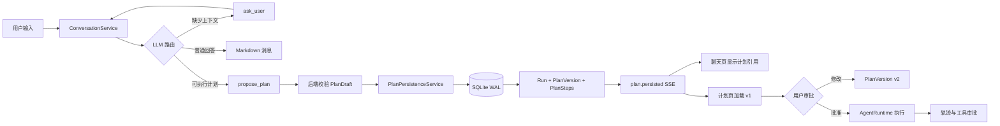

# 对话计划持久化与计划页联动开发文档

> 文档状态：开发设计草案
>
> 创建日期：2026-08-20
>
> 适用分支：`codex/personal-agent-v1`

## 1. 背景

Better Agent 的核心目标不是只回答一个问题，而是帮助用户把长期、复杂的目标持续推进下去。对于训练计划、学习计划、旅行计划、项目方案等请求，模型输出的内容应当同时具备两种形态：

1. 面向用户的可读回答，用于解释方案、说明假设和给出下一步。
2. 面向 Agent Runtime 的结构化计划，用于版本管理、用户审批、执行、轨迹记录和后续调整。

当前系统已经具备 `PlanVersion`、计划步骤、计划审批、步骤取消、计划修订和执行轨迹等基础能力。但是，对话路径和执行路径尚未完全打通：模型可以在聊天窗口生成一份看起来完整的计划，却没有一定会生成对应的 `Run` 和 `PlanVersion`。

因此，用户在聊天窗口看到了计划，打开“计划版本”页面却仍然是空页面。这不是计划版本服务本身不存在，而是模型可读回答没有被转换成系统可管理的计划实体。

## 2. 当前实现与问题定位

### 2.1 已有能力

- `backend/app/domain.py` 中的 `PlanVersionService` 已支持创建、修订、审批、完成步骤和取消步骤。
- `backend/app/runtime.py` 中的 `AgentRuntime.handle_message()` 已能调用模型规划，并将结果保存到 `plan_versions`、`plan_steps`，然后把运行状态置为 `AWAITING_APPROVAL`。
- `backend/app/conversation.py` 已支持对话线程、Ask、方向选择、对话事件和 SSE。
- `backend/app/db.py` 已启用 SQLite WAL，并已有 `goals`、`sessions`、`runs`、`plan_versions`、`plan_steps`、`thread_events` 等表。
- `frontend/src/pages/PlanPage.tsx` 已能根据 `run.id` 加载当前计划和历史版本。

### 2.2 当前断点

当前链路可以简化为：

```text
用户输入
  -> ConversationService
  -> LLM 返回 Markdown
  -> thread_messages 保存可读消息
  -> 对话页面显示计划
```

而计划页需要的是另一条链路：

```text
用户目标
  -> AgentRuntime
  -> PlanDraft
  -> PlanVersionService.create()
  -> runs.current_plan_version_id
  -> /api/runs/{run_id}/plans
  -> 计划页显示
```

两条链路之间缺少“计划提案”和“计划持久化”的明确边界。

### 2.3 用户可见问题

1. 模型回复了完整计划，但计划没有进入计划页。
2. 用户无法确认这份计划是否已经被系统保存。
3. 用户无法从计划页继续审批、修改或执行这份计划。
4. 轨迹页无法完整展示“模型生成计划 → 计划保存 → 用户审批”的过程。
5. 如果重试或 SSE 重连，计划可能被重复创建。
6. 如果直接解析 Markdown，表格、标题和自然语言很容易被错误转换为步骤。

## 3. 开发目标

### 3.1 主要目标

1. 当 LLM 判断当前请求是一个需要持续推进的可执行计划，并且用户明确要求创建、保存或按照方案执行时，生成结构化 `PlanDraft`。
2. 将 `PlanDraft` 保存为可版本化的 `PlanVersion`，并与当前对话 turn、Run 和用户目标关联。
3. 计划保存后，聊天页立即显示“已保存到计划 v1”，计划页可以直接查看同一份计划。
4. 保存计划与执行计划分离：保存只生成草稿，执行必须经过用户审批。
5. 所有计划保存动作都可幂等重试，并写入轨迹事件。
6. 不让 LLM 直接访问 SQLite、SQL、文件系统或通用数据库写入接口。
7. 保留现有 `ask_user` 的 LLM 决策机制，不使用 Python 关键词判断，也不硬编码固定问卷。

### 3.2 非目标

本阶段不包含：

- Markdown 解析器或基于正则的计划抽取。
- RAG、多 Agent、MCP、Shell、Redis、Celery 或微服务。
- 自动执行未经用户批准的计划。
- 让 LLM 自由生成数据库 ID、状态、版本号或 SQL。
- 一个对话中同时保存多个独立计划实体。
- 把普通知识解释、泛化攻略或临时建议全部自动保存为计划。

## 4. 应用场景

### 场景 A：长期训练计划

用户输入：“我想制作一个长期的训练计划，学习骑行。”

1. LLM 判断缺少骑行基础、目标和可用时间。
2. LLM 调用现有 `ask_user`。
3. 用户完成选择后，LLM 生成结构化训练计划。
4. 后端创建 `Run` 和 `PlanVersion v1`，状态为 `draft` / `AWAITING_APPROVAL`。
5. 聊天页展示计划摘要和“已保存到计划 v1”。
6. 用户进入计划页修改或批准。

### 场景 B：根据已有回答创建计划

用户先让模型给出一份力量训练方案，然后输入：“按照这个创建一个计划。”

1. LLM 识别这是明确的创建计划意图。
2. LLM 通过 `propose_plan` 返回结构化标题、摘要和步骤。
3. 后端持久化为 `PlanVersion v1`。
4. 原来的模型回答继续保留在对话中，并与计划版本关联。
5. 计划页不再显示空状态。

### 场景 C：普通知识问答

用户输入：“什么是力量训练？”

1. LLM 直接回答。
2. 不调用 `propose_plan`。
3. 不创建 Goal、Run 或 PlanVersion。

### 场景 D：旅行攻略

用户输入：“推荐一份广西一周旅游攻略。”

默认只生成可读攻略，不自动创建计划。只有当用户明确说“按照这个创建一个旅行计划”或选择“保存到计划”时，才生成结构化计划。

### 场景 E：计划修订

用户在计划页修改未完成步骤并保存：

1. 后端检查 `expected_version`。
2. 创建新的 `PlanVersion v2`。
3. 已完成步骤状态从 v1 继承。
4. v1 保留为历史版本，不覆盖、不删除。

## 5. 产品规则

### 5.1 何时自动保存

以下条件同时成立时，自动保存为草稿：

- LLM 判断输出是可持续推进的计划，而不是单纯解释或攻略。
- 用户已经明确表达创建、保存、执行或“按照这个做”的意图。
- LLM 能够给出结构化步骤。

如果模型只是输出了一份计划样式的 Markdown，但没有形成结构化计划提案，前端显示“保存到计划”按钮，用户点击后再发起结构化保存流程。

### 5.2 保存与执行分离

计划保存后的默认状态为：

```text
Run: AWAITING_APPROVAL
PlanVersion: draft
```

只有用户点击“批准计划并继续”后，状态才进入 `EXECUTING`。保存计划不应触发工具执行、文件写入或其他外部副作用。

### 5.3 工具与数据库边界

新增的 `propose_plan` 是模型可调用的受限结构化能力，不是通用数据库写入工具。

- LLM 只能提交标题、摘要和步骤。
- 后端负责生成 ID、版本、状态和时间戳。
- 后端负责调用 `PlanVersionService`。
- LLM 不能提交 `run_id`、`plan_version_id`、SQL 或任意表名。
- 计划保存行为写入轨迹，但不向用户暴露原始工具 JSON。

计划草稿是用户明确要求的本地、可逆操作，不需要复用高风险 `WRITE` 工具审批。真正的执行动作仍然遵循现有工具安全策略和审批流程。

## 6. 目标架构



### 6.1 `propose_plan` 工具契约

目标工具名称：`propose_plan`

```json
{
  "type": "function",
  "function": {
    "name": "propose_plan",
    "description": "为当前用户明确要求创建的长期或可执行目标提交结构化计划草稿，不执行计划。",
    "parameters": {
      "type": "object",
      "required": ["title", "summary", "steps"],
      "properties": {
        "title": {"type": "string"},
        "summary": {"type": "string"},
        "steps": {
          "type": "array",
          "minItems": 1,
          "items": {
            "type": "object",
            "required": ["title", "description"],
            "properties": {
              "id": {"type": "string"},
              "title": {"type": "string"},
              "description": {"type": "string"}
            }
          }
        }
      }
    }
  }
}
```

工具参数只表达模型的计划内容，不表达数据库持久化细节。工具调用完成后，后端返回 `run_id`、`plan_version_id` 和 `version` 给对话层，随后模型继续生成面向用户的最终说明。

### 6.2 双通道输出

一次计划请求需要产生两个结果：

1. 可读通道：用户看到的 Markdown、摘要、注意事项和下一步。
2. 结构化通道：`PlanDraft`，供后端保存和计划页展示。

不能通过解析可读 Markdown 来生成结构化计划。建议采用标准工具调用回合：

```text
LLM 调用 propose_plan
  -> 后端保存草稿
  -> 返回 plan_id/version 给模型
  -> 模型继续生成最终可读回答
```

如果模型只返回可读 Markdown 而没有调用 `propose_plan`，系统不自动猜测其结构；前端提供“保存到计划”入口，重新发起一个结构化计划请求。

## 7. 数据与事务设计

### 7.1 复用现有表

V1 不新增独立计划表，复用已有表：

| 表 | 用途 |
|---|---|
| `threads` | 对话容器 |
| `turns` | 当前对话回合及其状态 |
| `thread_messages` | 用户和模型的可读消息 |
| `goals` | 用户目标 |
| `sessions` | 目标会话 |
| `runs` | 一次可恢复的 Agent 执行上下文 |
| `plan_versions` | 计划版本 |
| `plan_steps` | 版本中的步骤 |
| `thread_events` / `events` | 对话和运行轨迹 |

已有的 `runs.source_turn_id`、`runs.current_plan_version_id`、`turns.materialized_run_id` 和 `turns.materialized_goal_id` 足以建立对话到计划的关联。

### 7.2 保存事务

后端应通过一个应用层持久化方法完成以下操作：

1. 检查当前 turn 是否已经有 `materialized_run_id`。
2. 如果已经存在，返回原来的计划引用，避免重复创建。
3. 创建 Goal、Session 和 Run。
4. 将 Run 从 `RECEIVED` 迁移到 `PLANNING`。
5. 创建 `PlanVersion v1` 和对应的 `PlanStep`。
6. 更新 Run 的 `current_plan_version_id`。
7. 更新 Turn 的 `materialized_goal_id` 和 `materialized_run_id`。
8. 写入 `plan.version_created`、`plan.persisted` 和关联事件。
9. 将 Run 置为 `AWAITING_APPROVAL`。

数据库写入使用现有 SQLite WAL 和事务机制。任何一步失败都不能留下只有 Run 没有 PlanVersion，或者 PlanVersion 没有步骤的半成品。

### 7.3 幂等性

计划保存的幂等键由 `turn_id + model_call_id` 组成。需要满足：

- SSE 重连不会重复创建计划。
- 模型重试不会生成第二个 v1。
- 同一个 turn 不能关联两个不同 Run。
- 只有显式修订才创建 v2。

可以在现有 `source_turn_id` 关联上增加唯一索引，或在应用事务中使用唯一查询和写入保护；两层都应保留，确保并发重试时数据库仍然安全。

## 8. 状态流转

### 8.1 对话状态

```text
ACCEPTED
  -> ROUTING
  -> AWAITING_INPUT       # ask_user
  -> STREAMING             # 最终回答
  -> COMPLETED
```

计划工具调用发生在模型路由确定为可执行计划之后，不应把原始工具参数直接展示给用户。

### 8.2 Agent Run 状态

```text
RECEIVED
  -> PLANNING
  -> AWAITING_APPROVAL
  -> EXECUTING             # 用户批准后
  -> AWAITING_OUTCOME / REFLECTING / COMPLETED
```

保存计划不等于批准计划，也不等于执行计划。

### 8.3 计划版本状态

```text
v1 draft
  -> approved
  -> v2 draft              # 用户修订
```

历史版本只读，当前版本才能被批准。已完成步骤在修订时继续保留完成状态。

## 9. 后端开发范围

### 9.1 模型与对话层

涉及文件：

- `backend/app/live_model.py`
- `backend/app/conversation.py`
- `backend/app/ask.py`

开发内容：

1. 增加 `PLAN_TOOL_SCHEMA` 和 `PlanProposal` 类型。
2. 保留 `ask_user` 的单次调用限制。
3. 支持模型调用 `propose_plan` 后继续一次模型回合。
4. 工具回合中隐藏原始 JSON，只向 UI 发出可读消息和计划引用。
5. 对错误结构、空步骤、重复工具调用、混合文本和工具流增加防护。

### 9.2 领域与 Runtime 层

涉及文件：

- `backend/app/domain.py`
- `backend/app/runtime.py`
- `backend/app/db.py`

开发内容：

1. 增加结构化计划提案校验。
2. 增加从 Conversation Turn 持久化计划草稿的方法。
3. 复用 `PlanVersionService.create()`，不另写一套版本逻辑。
4. 将计划保存和对话关联放进幂等事务。
5. 写入计划创建、保存、审批和修订事件。
6. 增加 `source_turn_id` 的重复保存保护。

### 9.3 API 与 SSE

涉及文件：

- `backend/app/api.py`
- `frontend/src/api.ts`

开发内容：

1. 保留已有 `/api/runs/{run_id}/plans` 接口。
2. 增加按 thread 查询关联计划的接口，解决刷新后前端没有 Run 状态的问题。
3. 在对话 SSE 中发送 `plan.persisted` 事件，包含 `run_id`、`goal_id`、`plan_version_id` 和 `version`。
4. 所有写接口继续使用 JSON、CSRF、本地来源校验。

## 10. 前端开发范围

涉及文件：

- `frontend/src/types.ts`
- `frontend/src/api.ts`
- `frontend/src/App.tsx`
- `frontend/src/pages/ChatPage.tsx`
- `frontend/src/pages/PlanPage.tsx`
- `frontend/src/components/ConversationThread.tsx`
- `frontend/src/components/ActivityRail.tsx`
- `frontend/src/hooks/useThreadTelemetry.ts`

用户体验目标：

1. 模型回答完成后显示“已保存到计划 v1”。
2. 提供“查看计划”按钮，直接打开对应计划版本。
3. 计划页刷新后仍能从当前对话恢复关联计划。
4. 计划保存失败时，保留聊天回答，并显示“重试保存”而不是丢失内容。
5. “保存计划”和“批准并执行”使用不同按钮和不同说明。
6. 轨迹中展示“计划提案、计划保存、计划审批、计划修订”，不显示原始 JSON。

## 11. 测试方案

### 11.1 后端单元测试

- `propose_plan` 参数必须包含标题、摘要和至少一个步骤。
- 空标题、空步骤、错误类型和超长字段被拒绝。
- 计划步骤 ID 缺失时由后端生成，不接受模型伪造版本号。
- 同一个 turn 重复保存返回同一个 Run 和 PlanVersion。
- PlanVersion v2 修订保留 v1 和已完成步骤。

### 11.2 后端集成测试

- 用户完成 Ask 后，计划提案可以保存到 `plan_versions` 和 `plan_steps`。
- `turns.materialized_run_id`、`runs.source_turn_id` 和 `current_plan_version_id` 正确关联。
- 保存过程失败时事务回滚，不留下孤立 Run。
- 普通知识回答不创建 Goal、Run 或 PlanVersion。
- 保存计划后 Run 为 `AWAITING_APPROVAL`。
- 未批准前不会执行工具。
- 批准后才进入 `EXECUTING`。
- `plan.persisted` 事件的 seq 连续且可通过 SSE 读取。
- 模型重试、SSE 重连和重复点击不会重复创建计划。

### 11.3 前端测试

- 收到 `plan.persisted` 后显示计划引用卡片。
- 点击“查看计划”可以打开对应计划页。
- 没有 Run 但有 thread 计划时，计划页可以正常加载。
- 计划保存失败时保留原始回答并显示重试入口。
- “保存计划”和“批准并执行”按钮不会混淆。
- 轨迹页展示计划生命周期事件，不渲染原始工具 JSON。

### 11.4 验证命令

```powershell
Set-Location D:\RAG\better\backend
& D:\pycharm\python.exe -m pytest -q

Set-Location D:\RAG\better\frontend
npm test -- --run
npm run build
```

真实模型测试继续优先使用：

```text
D:\Users\王一鸣\Desktop\直到尽头\LLM_AP.txt
```

不得将密钥、`data/`、`memory/` 或评测结果提交到仓库。

## 12. 分阶段实施顺序

### 阶段 1：结构化协议

先写 `propose_plan` 解析、参数校验和模型回合失败测试，再实现最小协议支持。

验收：模型可以返回合法 `PlanProposal`，普通回答不会误触发计划提案。

### 阶段 2：计划持久化

先写事务、幂等、回滚和事件测试，再接入 `PlanVersionService` 和 Run 关联。

验收：一次计划提案能生成 v1，重复请求不会生成 v2。

### 阶段 3：对话与 SSE 联动

先写对话 Worker 和 SSE 测试，再把 `plan.persisted` 事件接入现有 thread telemetry。

验收：聊天窗口能明确显示计划已保存，轨迹能看到计划生命周期。

### 阶段 4：计划页与审批

先写前端组件测试，再实现计划引用卡片、计划页恢复、修订和审批按钮联动。

验收：用户可以从聊天回答进入 v1 计划，修改生成 v2，批准后进入执行。

### 阶段 5：真实模型与全量回归

使用 `LLM_AP.txt` 验证训练计划、力量训练计划、普通知识问答和旅游攻略四类请求，再运行后端全量测试、前端测试和构建。

## 13. 验收标准

以下场景全部通过后，才算完成本功能：

1. 输入“按照这个创建一个计划”，模型回答和计划页都能看到同一份计划。
2. 计划页能显示标题、摘要、步骤、版本号和当前状态。
3. 页面刷新后计划仍然存在。
4. 用户修改后生成 v2，v1 仍可查看。
5. 用户未批准前，任何外部工具都不会执行。
6. 用户批准后，Run 进入执行状态，轨迹和工具审批正常工作。
7. Ask、计划保存、计划审批和计划执行的原始 JSON 不直接暴露给用户。
8. 普通问答和泛化攻略不会无条件创建计划。
9. 重试、取消、SSE 重连和服务重启不会造成重复计划或孤立数据。
10. 后端、前端测试和前端构建全部通过。

## 14. 默认产品决策

本设计默认采用以下决策：

- 用户明确要求“创建、保存、按照这个执行”时，计划自动保存为草稿。
- 计划保存和计划执行分离，执行必须由用户批准。
- 模型通过受限的 `propose_plan` 决定是否提交结构化计划，不使用 Python 关键词判断。
- 后端是唯一的数据库写入方，LLM 不接触 SQL 和数据库连接。
- V1 复用现有计划表和 Runtime，不新增通用 Artifact 数据库。
- 如果模型只给出 Markdown 而没有结构化提案，系统不猜测内容，提供“保存到计划”操作供用户明确触发。

