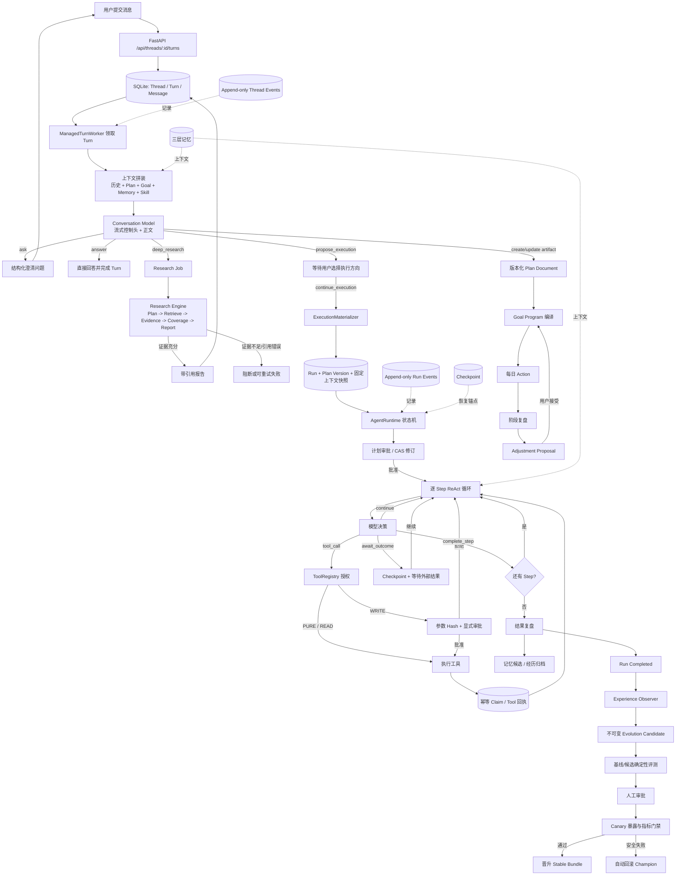
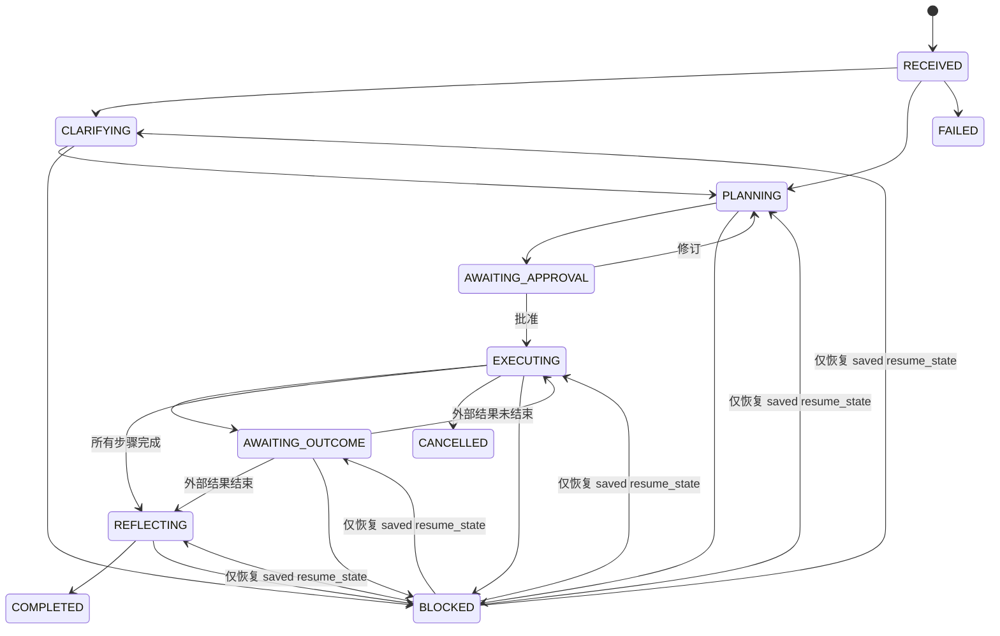
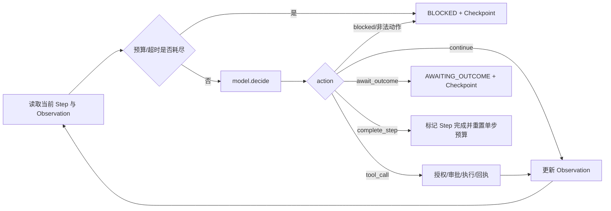
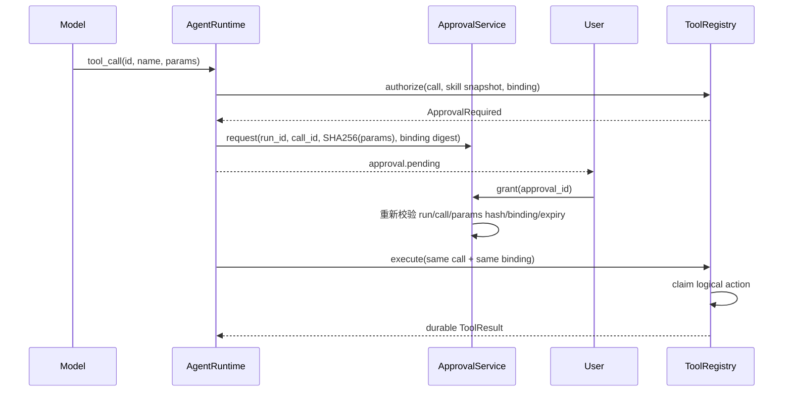
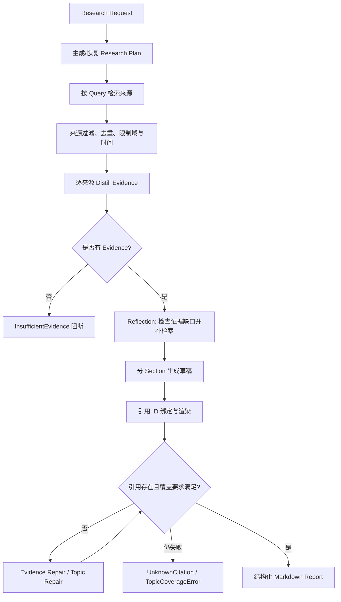
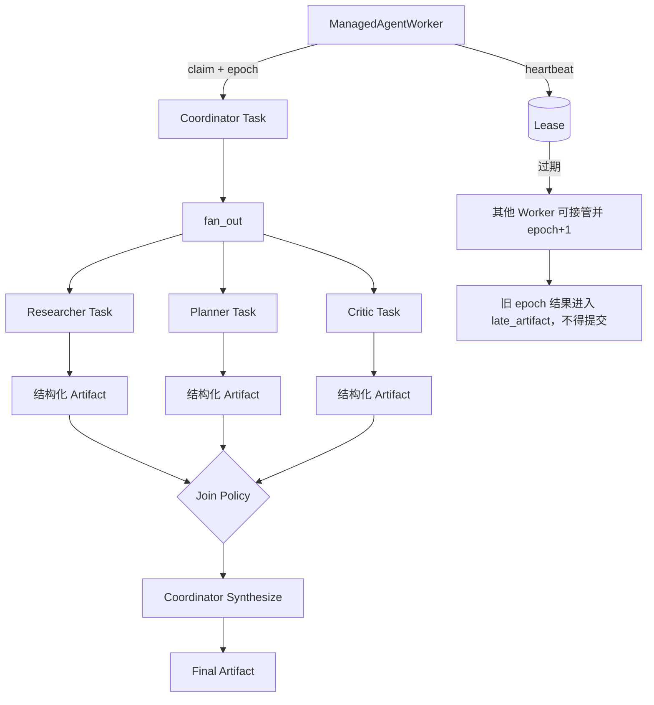
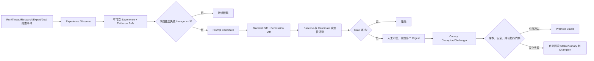

# Better Agent 后端全流程学习文档

> 基于当前仓库代码整理。目标是从一次用户请求出发，理解“需求澄清 -> 深度研究 -> 计划生成 -> 工具执行 -> 结果复盘 -> 动态调整 -> 持续成长”的完整闭环，并掌握支撑该闭环的状态机、ReAct、可靠性、记忆、研究、Expert Run 与 Evolution 机制。
>
> **同步基线（2026-08-31）**：分支 `codex/personal-agent-v1`，源码提交 `cb24fc4 feat: localize user-facing agent messages`。该提交保留稳定的英文机器协议，并新增统一的中文用户展示层。最近一次全量验证为后端 `594 passed, 3 skipped`、前端 `177 passed`，TypeScript 与 Vite 生产构建通过。

## 0. 先说结论

Better Agent 不是一个“收到问题后直接调用一次大模型”的聊天后端，而是一个本地单用户 Agent Runtime。它把系统分成两个执行平面：

1. **对话控制平面**：`ConversationService + ManagedTurnWorker` 接受消息，拼装上下文，让模型输出受约束的路由头，决定直接回答、追问、深度研究、生成计划或建议进入执行。
2. **任务执行平面**：`AgentRuntime` 把获批计划物化为持久化 Run，以状态机约束生命周期，在每个 Plan Step 内运行 ReAct 循环，并通过工具授权、审批、事件、Checkpoint 和预算保证可控执行。

SQLite 是两层共同的事实源。Thread Event 与 Run Event 提供追加式轨迹；Memory、Research、Goal Program、Expert Run 和 Evolution 都以持久化记录接入主链，而不是依赖进程内隐式状态。

## 1. 后端总流程图



**流程说明：** 用户消息先进入对话控制平面，由持久化 Worker 调用模型做路由；普通问题直接回答，需要资料时进入证据优先研究，需要长期执行时先生成版本化计划并等待用户确认。确认后，执行物化器冻结计划来源和技能快照，创建 Run 并交给 AgentRuntime。Run 在状态机允许的边上迁移，每个步骤内部用 ReAct 决策是否继续思考、调用工具、等待结果或完成。所有关键动作写入追加式事件，WRITE 工具必须绑定调用 ID、参数 Hash、授权上下文和人工审批；Checkpoint 与幂等回执使重启后的人工续跑不会重复副作用。执行完成后，一条路径沉淀记忆并驱动每日复盘/调整，另一条路径由 Experience Observer 生成受控演进候选，经评测、人工批准和 Canary 门禁后才可能晋升。

## 2. 推荐学习顺序

| 阶段 | 先看什么 | 要解决的问题 |
| --- | --- | --- |
| 1. 启动与装配 | `scripts/serve.py`、`backend/app/startup.py`、`backend/app/main.py` | 服务如何把 DB、模型、工具、Worker 和各子系统组装起来？ |
| 2. 对话入口 | `backend/app/api.py`、`backend/app/conversation.py`、`backend/app/live_model.py` | 一条消息怎样被持久化、领取、路由和流式输出？ |
| 3. 执行核心 | `backend/app/domain.py`、`backend/app/runtime.py` | 状态机、计划版本和 ReAct 如何配合？ |
| 4. 可靠执行 | `backend/app/events.py`、`backend/app/tools.py`、`backend/app/domain.py` | 如何审批 WRITE、去重工具调用、阻断异常和恢复？ |
| 5. 记忆 | `backend/app/memory_v2.py`、`backend/app/memory_archive.py`、`backend/app/context.py` | 短期、经历、长期记忆如何选择、审计和限额？ |
| 6. 深度研究 | `backend/app/research/engine.py`、`service.py`、`worker.py` | 如何从来源变成 Evidence，再变成可验证报告？ |
| 7. Expert Run | `backend/app/agents.py` | 租约、心跳、epoch fencing、Artifact 和汇总如何工作？ |
| 8. 调整与成长 | `goal_programs.py`、`goal_reviews.py`、`goal_adjustments.py`、`experience_observer.py`、`evolution.py` | 日常反馈怎样变成调整；失败模式怎样变成受控演进？ |

## 3. 启动与依赖装配

`scripts/serve.py` 创建唯一的 `AgentRuntime`，然后把它挂到 FastAPI。`build_runtime()` 是阅读后端的第一个关键函数，因为它展示了真实的依赖图：

```python
# scripts/serve.py
data_root = Path(os.getenv("BETTER_AGENT_DATA_ROOT", str(ROOT / "data"))).resolve()
runtime = build_runtime(data_root)
app = create_app(runtime=runtime, static_dir=ROOT / "frontend" / "dist")
uvicorn.run(app, host=os.getenv("BETTER_AGENT_HOST", "0.0.0.0"), port=int(os.getenv("PORT", "8000")))
```

`build_runtime()` 依次创建 `Database -> EventStore -> ApprovalService -> ToolRegistry -> Model Gateway -> AgentRuntime`，随后注入 Memory V2、Research、Schedule、Behavior Bundle、Evolution、Experience Observer 和 Expert Worker。FastAPI lifespan 启动各 Managed Worker，关闭时按顺序停止。

核心设计点：

- **本地单用户**：默认入口使用 loopback；SQLite 开启 WAL 和 busy timeout。
- **单体但分层**：不是微服务，但每个子系统通过 service/worker/store 边界解耦。
- **模型可替换**：无 Profile 时 Runtime 执行使用确定性 Mock；真实对话在未配置模型时明确失败，不静默伪装。
- **启动恢复**：Plan Document 会恢复未完成投影；Memory 会恢复投影。Agent Run 提供 `recoverable_runs()` 和显式 `/resume`，当前实现不是启动时无条件自动执行所有非终态 Run。

## 4. 第一段主链：对话控制平面

### 4.1 请求先落库，再异步处理

HTTP 层只负责校验、CSRF/idempotency 等边界，并调用 `ConversationService.accept_turn()`。Turn、用户 Message 与 `turn.accepted` 事件先在同一事务中落库，Worker 再领取任务，这避免了“请求已返回但任务只存在内存”的丢失窗口。

简化后的数据流：

```text
POST /api/threads/{thread_id}/turns
  -> accept_turn(client_turn_id, content, skills)
  -> INSERT turn + user message + thread event
  -> 202/accepted
  -> ManagedTurnWorker.claim_next()
  -> process_turn()
```

### 4.2 模型同时完成路由与回复

`ControlHeadDecoder` 要求模型流的前部先给一个有大小上限的 JSON 控制头，后续才是用户可见正文。这样系统不必先做一次分类模型调用、再做一次生成调用，也避免模型在正文里随意伪造控制字段。

典型策略包括：

- `answer`：直接回复。
- `ask`：创建结构化 Ask，Turn 进入等待用户状态。
- `deep_research`：创建 Research Job。
- `create_artifact` / `update_artifact`：保存版本化计划文档。
- `propose_execution`：展示执行方向，用户确认后物化为 Run。

`ExecutionMaterializer` 是两条主链的桥。它使用 `expected_version + idempotency_key` 保护方向选择，冻结 Plan Document version/content hash，创建 Goal、Session、Run 和 Plan Version，并把 Thread 的技能快照绑定到 Run。

```python
# backend/app/conversation.py（节选）
if action == "modify_plan":
    return self._modify_direction(turn_id, expected_version, idempotency_key)
if action != "continue_execution":
    raise ValueError("unsupported direction action")

result = await self.materializer.materialize(
    turn_id, expected_version, idempotency_key, action
)
if result.created:
    await self.agent_runtime.handle_message(result.run_id, content, [])
```

这里的关键不是“创建一条 Run 记录”，而是把对话阶段可能变化的上下文转换为执行阶段可重放的固定输入：来源文档版本、内容 Hash、计划版本、技能版本和 Runtime Bundle 都有明确身份。

## 5. 第二段主链：状态机与计划版本

### 5.1 状态机是硬约束，不是 UI 标签



核心代码：

```python
# backend/app/domain.py
if current in self._terminal:
    raise InvalidTransition(f"terminal state {current} cannot transition")
if current == AgentState.BLOCKED:
    if resume_state is None or target != resume_state:
        raise InvalidTransition("blocked run may only resume its saved state")
if target not in self._allowed.get(current, set()):
    raise InvalidTransition(f"{current} -> {target} is not allowed")
```

这段约束解决两个问题：终态不能“复活”；BLOCKED 只能回到阻断前保存的状态，不能由 API 任意跳转。

### 5.2 计划用版本而不是原地覆盖

规划完成后创建 `plan_versions` 和对应 Step。修订时调用方必须提供 `expected_version`，事务内读取当前版本并比较；不一致就抛出 `PlanConflict`。新版本保留 `base_version`，并把已经完成的 Step 状态带到新版本。

```python
# backend/app/domain.py
current_version = current_row["version"] if current_row else 0
if current_version != expected_version:
    raise PlanConflict(
        f"expected plan version {expected_version}, current is {current_version}"
    )
version = current_version + 1
self._insert(..., version, ..., expected_version, normalized_steps, ...)
```

这就是 CAS（Compare-And-Swap）语义：用户基于旧版本编辑时不会覆盖新版本。

## 6. ReAct 执行循环

`AgentRuntime._execute_locked()` 负责选择下一个未完成 Step；`_execute_step()` 在单个 Step 内执行 ReAct。这里的 ReAct 不是无限循环，而是一个有状态、有预算、有可观察事件的决策循环。



核心代码：

```python
# backend/app/runtime.py（节选）
if time.monotonic() - started > self.config.max_step_wall_time_seconds:
    return self._block(
        run_id,
        "STEP_WALL_TIME_EXHAUSTED",
        reason_message("STEP_WALL_TIME_EXHAUSTED"),
        budget,
        "budget.exhausted",
    )
if not pending and int(budget.get("react_iterations_remaining", 0)) <= 0:
    return self._block(
        run_id,
        "REACT_ITERATION_BUDGET_EXHAUSTED",
        reason_message("REACT_ITERATION_BUDGET_EXHAUSTED"),
        budget,
        "budget.exhausted",
    )

budget["react_iterations_remaining"] -= 1
decision = await self._model_call(
    run, "react", self.model.decide, step_payload, observation, iteration + 1
)

if decision.action == "complete_step":
    self.plans.mark_step_completed(plan.id, step_id)
elif decision.action == "await_outcome":
    self._transition(..., AgentState.AWAITING_OUTCOME, ...)
    self._save_checkpoint(run_id, decision.observation, pending_actions=[])
elif decision.action == "continue":
    observation = decision.observation
elif decision.action == "tool_call":
    ...
```

### 6.1 英文协议层与中文展示层

最新实现没有把所有英文标识符直接改成中文，而是明确分成两层：

| 层次 | 例子 | 设计要求 |
| --- | --- | --- |
| 机器协议层 | `complete_step`、`tool_call`、`budget.exhausted`、`PENDING`、`ACTIVE` | 保持稳定、可枚举、可测试，不能因为界面语言变化而破坏模型协议、数据库状态或事件消费者 |
| 用户展示层 | “本步骤的执行轮次已用完”“工具调用未通过安全授权”“已完成” | 由后端公开文本映射和前端本地化函数统一产生，不把内部诊断文本直接暴露给用户 |

`backend/app/public_text.py` 是运行时阻断信息的后端出口。`AgentRuntime._block()` 写入稳定的 `blocked_reason_code` 和中文 `blocked_message`；`public_budget()` 在 API 返回前移除内部的 `identical_actions`、旧版 `blocked_reason`，并只暴露动作计数和可展示原因。当前稳定原因码包括：

| 原因码 | 中文展示 |
| --- | --- |
| `STEP_WALL_TIME_EXHAUSTED` | 当前步骤执行超时 |
| `REACT_ITERATION_BUDGET_EXHAUSTED` | 本步骤的执行轮次已用完 |
| `IDENTICAL_ACTION_BUDGET_EXHAUSTED` | 模型重复执行了相同操作，任务已暂停 |
| `CONSECUTIVE_TOOL_ERRORS_EXHAUSTED` | 工具连续执行失败，任务已暂停 |
| `INVALID_MODEL_ACTION` | 模型返回了无法识别的操作 |
| `MODEL_REQUESTED_BLOCK` | 模型请求暂停当前任务 |
| `TOOL_AUTHORIZATION_DENIED` | 工具调用未通过安全授权 |
| `MODEL_AUTHENTICATION` / `MODEL_RATE_LIMIT` / `MODEL_REQUEST` / `MODEL_SERVER` / `MODEL_TIMEOUT` / `MODEL_UNKNOWN` | 对应的中文模型故障提示 |

兼容历史数据也在这一层完成：旧数据库中的 `react iteration budget exhausted` 等英文原因会经 `LEGACY_RUNTIME_REASONS` 转换为新原因码。前端 `frontend/src/localization.ts` 负责状态、角色、作用域等枚举的中文标签；`frontend/src/trajectory.ts` 根据 `reason_code` 渲染轨迹，并保留对旧事件 `reason` 字段的兼容。这样旧 Run 和旧轨迹升级后仍可阅读。

这项边界应准确理解为“用户主流程建立了统一中文展示出口”，而不是“源码中不再存在英文”。协议值、类名、事件名、第三方错误和部分开发者诊断仍然使用英文；新增 API 时仍需避免把 `str(exc)` 未经映射直接作为最终用户文案。

额外的循环保护包括：

- 每 Step 最大 ReAct 次数。
- 每 Step 最大墙钟时间。
- 相同 `tool name + params` 的重复动作预算。
- 连续工具错误预算。
- 非法 action 直接 BLOCKED。
- 用户可在“迭代预算耗尽”后显式增加预算，再恢复执行。

## 7. 可恢复与可审计执行

### 7.1 Append-only Event

`EventStore.append()` 为每个 Run 计算递增 `seq` 并只插入新事件。Thread 侧另有 `ThreadEventStore`，同样使用持久游标。SSE 客户端用 `after_seq` 重连，因此展示层可以从事件轨迹恢复，而不依赖内存队列。

```python
# backend/app/events.py
next_seq = connection.execute(
    "SELECT COALESCE(MAX(seq), 0) + 1 FROM events WHERE run_id = ?",
    (event.run_id,),
).fetchone()[0]
connection.execute("INSERT INTO events(...) VALUES (...)" , (..., next_seq, ...))
```

注意：append-only 主要约束业务写入路径；它不是密码学不可篡改日志。若要达到防篡改审计，还需事件链 Hash、签名或外部 WORM 存储。

### 7.2 Checkpoint

Checkpoint 保存状态、计划版本、当前 Step、已完成 Step、ReAct iteration、剩余预算、Observation、Artifact、待审批和待执行动作，以及最后事件序号。

```python
# backend/app/runtime.py（字段节选）
Checkpoint(
    run_id=run_id,
    state=run.state.value,
    plan_version_id=run.current_plan_version_id,
    step_id=run.current_step_id,
    completed_steps=[...],
    react_iteration=int(run.budget.get("react_iteration", 0)),
    remaining_budget=run.budget,
    observation=observation,
    pending_actions=pending_actions or [],
    last_event_seq=last_seq,
)
```

进程重启后，`recoverable_runs()` 能扫描所有非终态 Run；用户通过 `/api/runs/{run_id}/resume` 显式续跑。测试 `backend/tests/test_restart_recovery.py` 验证了重启后 WRITE 不会再次执行。

### 7.3 工具调用的幂等与不确定副作用

工具层使用 `(run_id, tool_call_id)` 作为逻辑动作键，并绑定 `tool_name + params_hash`：

```python
# backend/app/tools.py（节选）
logical_key = f"{run_id}:{call.id}"
row = connection.execute(
    "SELECT * FROM tool_execution_claims WHERE logical_action_key=?", (logical_key,)
).fetchone()

if row and row["params_hash"] != params_hash:
    raise ToolRejected("tool execution binding changed")
if row and row["status"] == "COMPLETED":
    return ToolResult(**json.loads(row["result_json"]))
if row and row["status"] == "RUNNING" and risk == ToolRisk.WRITE:
    # 崩溃点可能位于外部副作用之后、回执之前，不能盲目重试
    mark_reconciliation_required()
```

这比简单“失败就重试”更严谨。WRITE 在 RUNNING 状态下重启时，系统无法判断外部副作用是否已发生，因此转为 `RECONCILIATION_REQUIRED`，要求人工或连接器对账。

### 7.4 WRITE 工具的参数 Hash 与显式审批



`normalized_params_hash()` 对排序后的 JSON 做 SHA-256；审批不仅绑定参数，还绑定运行时授权上下文的 digest。批准时和真正执行时都会重新校验，因此模型不能在用户批准后替换参数。

## 8. 三层记忆系统

当前 Memory V2 可按下面三层理解：

| 层次 | 当前代码载体 | 生命周期 | 主要作用 |
| --- | --- | --- | --- |
| 短期记忆 | Thread Messages、Turn Context、`memory_context_pins` | 当前对话/当前模型调用 | 保持消息历史和本次调用使用的固定上下文 |
| 经历记忆 | `memory_episodes` | 跨 Turn，可限制为 thread/project | 保存归档后的对话片段摘要、决策和开放问题 |
| 长期语义记忆 | `memory_entries + memory_revisions + memory_fts` | 用户或项目级长期存在 | 保存 preference、constraint、fact、decision、lesson |

### 8.1 SQLite 是权威源，Markdown 是投影

Entry、Revision、Proposal、Episode、Audit Event 和 Context Pin 都存 SQLite。`MemoryStore.project()` 可以生成便于查看的文件投影，但冲突判断、当前 revision、FTS 和审计都以 DB 为准。

### 8.2 作用域、FTS5 与 Token Budget

```python
# backend/app/memory_v2.py（节选）
matched = {
    row[0] for row in connection.execute(
        "SELECT entry_id FROM memory_fts "
        "WHERE owner_id=? AND memory_fts MATCH ? LIMIT 50",
        (request.owner_id, request.query.strip()),
    )
}

entries = connection.execute(
    "... WHERE e.owner_id=? AND e.status='ACTIVE' "
    "AND (e.scope_type='user' OR (e.scope_type='project' AND e.scope_id=?))",
    (...),
).fetchall()

if semantic + cost <= request.semantic_token_budget:
    chosen_entries.append(row["revision_id"])
if episodic + cost <= request.episode_token_budget:
    chosen_episodes.append(row["id"])
```

选择顺序综合 pinned、FTS/query 命中、作用域、importance 和稳定 ID。语义记忆与 Episode 使用独立预算，避免某一层吃掉全部上下文。

### 8.3 可审计、可回滚、可脱敏

- Edit 必须携带 `base_revision_id`，形成 Memory CAS。
- Rollback 不是改指针，而是创建新的 `ROLLBACK` revision，历史仍可审计。
- 模型产生的是 Proposal，接受后才写入正式 Entry。
- Secret-like 长期记忆直接拒绝；Episode 摘要用 `[REDACTED]` 脱敏。
- `memory_context_pins` 记录某次 model invocation 实际使用的 revision、episode、预算和 rendered hash，便于复现。

边界：当前 FTS5 是词法检索，不是向量语义检索；Token 估算器是 `chars-v1`，按字符数近似，并非模型原生 tokenizer。

## 9. 证据优先的深度研究



核心代码体现了 fail-closed：

```python
# backend/app/research/engine.py（节选）
evidence = [
    *request.recovered_evidence,
    *await self._distill(new_sources, request, plan),
]
if not evidence:
    raise InsufficientEvidence(reason, diagnostics, retryable=retryable)

# 后续渲染时，引用必须能解析到已知 Evidence/Source；
# 主题覆盖校验失败则修复，仍失败抛 TopicCoverageError。
```

需要理解的四个对象：

- `Source`：检索得到的网页或本地资料，包含来源身份。
- `Evidence`：从 Source 中提炼出的可用于论证的证据片段，绑定 Source ID。
- `CuratedSection`：报告章节及其证据约束。
- `ResearchEvent`：planning、retrieving、distilling、writing 等阶段事件，用于 UI 进度和恢复。

`ResearchService` 负责 Job、Lease、阶段与恢复材料；`ManagedResearchWorker` 负责领取 Job、续租、驱动 Engine，并把阶段性 Source/Evidence/Section 持久化。失败会区分 retryable 与不可重试，而不是在不同搜索供应商之间静默回退。

## 10. 受控 Multi-Agent Expert Run

Expert Run 的目标不是允许任意 Agent 自由修改系统，而是让 Coordinator 把复杂问题拆成只读专家任务，用结构化 Artifact 汇总。



可靠性核心：

```python
# backend/app/agents.py（语义化节选）
task = claim_next(owner, lease_seconds)       # claim 时增加 lease_epoch
heartbeat(task_id, owner, epoch, lease_seconds)
owned = SELECT ... WHERE id=? AND lease_owner=? AND lease_epoch=?
if not owned:
    save_as_late_artifact(...)
    raise AgentTaskConflict("task lease lost")
```

- **Lease**：Worker 只在租约期内拥有任务。
- **Heartbeat**：长任务定期续租。
- **Epoch fencing**：每次重新领取提升 epoch；旧 Worker 即使迟到也无法提交到新 epoch。
- **结构化 Artifact**：不同角色的结果需通过 schema 校验，再供 Coordinator 汇总。
- **边界与深度**：`max_depth`、`max_children` 限制任务树膨胀。
- **Safety Judge**：专家可观察输出可进入独立安全判断。

实现边界：当前 Coordinator 会创建多个专家子任务并通过持久化队列协调，但默认 `ManagedAgentWorker` 是一个进程内 Worker 循环，任务通常逐个领取。架构支持启动多个 Worker 后并发处理，不应仅凭“fan-out”宣称当前默认部署已在单进程内使用 `asyncio.gather` 并行执行专家。

## 11. 结果复盘与动态调整

### 11.1 Run 结束后的 Reflection

所有 Plan Step 完成后，状态从 EXECUTING 进入 REFLECTING。模型产出记忆候选，Runtime 校验字段后写入候选区；非法候选被丢弃并记事件。随后 Run 进入 COMPLETED，并结束可能存在的 Canary exposure。

```python
# backend/app/runtime.py
candidates = await self._model_call(
    run, "reflection", self.model.reflect, goal, plan, run_id
)
for candidate in candidates:
    self.memory.create_candidate(...)
self._transition(..., AgentState.COMPLETED, {"candidates": len(candidates)})
self.events.append(..., "run.completed", ...)
```

### 11.2 Goal Program 把长期计划变成每日动作

版本化 Plan Document 可编译为 Goal Program，再展开为带日期、时长、完成标准和必选标记的 Daily Action。Action 支持 complete、skip、defer、feedback；阶段 Review 根据执行记录提出 Adjustment Proposal。

Adjustment 不会直接重写历史：

- Proposal 基于 Program version 和未来 Action snapshot。
- 接受时再次检查 version、当前 program head 和 Action snapshot。
- 已完成、跳过或延期的历史 Action 是 protected key，候选不得改写。
- 接受后创建新的 Goal Program Version，旧的未来 Action 标记为 SUPERSEDED。
- 同步回 Plan Document 仍需 version/hash CAS。

这使“动态调整”成为显式、版本化、可拒绝的用户决策，而不是模型悄悄改计划。

## 12. Experience Observer 与受控 Evolution



### 12.1 Observer 不直接改行为

`ExperienceObserver` 扫描已终结的 Run、Thread、Agent Task 和 Goal 事件，提取 outcome、failure tags、runtime bundle 和安全的 evidence refs，调用 `record_experience()` 写不可变 Experience。Candidate Generator 只关注 discovery 分区中的重复独立失败；少于 3 个不同 lineage group 不生成候选。

### 12.2 Candidate 只是不可执行提案

Candidate 记录：base/target bundle、manifest diff、permission diff、experience IDs 及多个 digest。模型只能提出 prompt 文本；是否允许进入后续阶段由代码门禁决定，不能增加权限、工具或核心策略。

### 12.3 评测、审批、Canary、晋升与回滚

```python
# backend/app/evolution.py（Canary 晋升门禁）
if len(challenger) < self.minimum_canary_samples:
    raise EvolutionGateError("not enough challenger samples")
if any(row["safety_pass"] != 1 for row in exposures):
    raise EvolutionGateError("canary safety gate failed")
if any(row["success"] != 1 for row in exposures):
    raise EvolutionGateError("canary success gate failed")
self._switch_channel(connection, "stable", candidate["target_bundle_id"], ...)
```

运行结束时收集 success、safety、TTFT、调用次数、尝试次数、成本及 routing/profile/skill digest。若 Challenger 的安全判断为 false，系统在同一事务中把 deployment 和 candidate 标记为 ROLLED_BACK，并把 canary/stable channel 都切回 Champion。

这条链的本质是：**模型可以提出改变，但模型不能批准、部署或绕过门禁。**

## 13. 五个亮点与代码证据对照

| 亮点 | 核心机制 | 主要源码 | 当前实现边界 |
| --- | --- | --- | --- |
| 可恢复 Agent 执行 | 状态机、Checkpoint、Run Event、CAS、预算、工具 Claim/回执、参数 Hash 审批 | `runtime.py`、`domain.py`、`events.py`、`tools.py` | 重启后列出可恢复 Run 并显式 resume；不是默认无条件自动续跑所有任务 |
| 三层记忆 | Thread 短期上下文、Episode、Entry/Revision、FTS5、作用域、预算、Pin、脱敏 | `memory_v2.py`、`memory_archive.py`、`conversation.py` | FTS5 为词法检索；token 为字符近似；不是向量 RAG |
| 证据优先研究 | Source -> Evidence -> Section -> Citation，覆盖审计，证据不足阻断 | `research/engine.py`、`service.py`、`worker.py`、`citations.py` | 报告质量仍依赖检索和模型；代码保证引用身份与最低证据门禁，不等价于事实绝对正确 |
| 受控 Expert Run | Coordinator、角色子任务、Lease、Heartbeat、Epoch、Artifact、Join/Synthesis | `agents.py` | 默认单 Worker 循环；持久化队列支持多 Worker 扩展，但默认部署不能夸大为真正并行 |
| 受控 Evolution | Experience、独立 lineage 门槛、不可变 Candidate、确定性评测、人工审批、Canary、自动回滚 | `experience_observer.py`、`evolution.py`、`behavior.py`、`real_evaluation.py` | 当前自动候选主要针对 prompt；核心安全策略和权限不能被候选自动修改 |

## 14. 核心数据一致性模型

本项目的可靠性不是靠单一技术，而是多层约束叠加：

| 风险 | 防线 |
| --- | --- |
| 并发覆盖计划/记忆/调整 | `expected_version`、`base_revision_id`、content hash CAS |
| HTTP 重试重复创建 | client ID / idempotency key + request digest + receipt |
| Worker 崩溃丢任务 | DB Queue + Lease + Heartbeat |
| 旧 Worker 迟到覆盖新结果 | lease epoch fencing + late artifact |
| 工具重复副作用 | tool_call ID + params hash + execution claim + completed receipt |
| WRITE 执行前参数被替换 | approval params hash + authorization binding digest + 二次校验 |
| WRITE 已执行但回执丢失 | RECONCILIATION_REQUIRED，禁止盲重试 |
| 模型无限循环 | iteration/wall-time/identical-action/error budget |
| 研究无证据生成 | InsufficientEvidence / UnknownCitation / TopicCoverageError |
| 记忆污染 | Proposal 人工确认、scope、revision、audit、secret rejection |
| 演进越权 | permission diff、评测、人工审批、Canary、安全自动回滚 |

## 15. 如何验证这些机制

### 15.1 启动完整应用

从仓库根目录启动：

```powershell
Set-Location D:\RAG\better
python scripts/start.py
```

`scripts/start.py` 会先构建前端，再让 FastAPI 在 `http://127.0.0.1:8000` 同源托管 API 与 `frontend/dist`。未配置真实模型时使用确定性 Mock，适合检查 UI/API 闭环；真实模型、Tavily 和本地数据目录的环境变量以根目录 `README.md` 为准，密钥不得写入本文档或提交到仓库。

### 15.2 分模块回归

按风险从小到大运行：

```powershell
Set-Location backend

# 状态机、执行、审批、Checkpoint、重启恢复
python -m pytest -q tests/test_state_machine.py tests/test_runtime.py `
  tests/test_approval.py tests/test_checkpoint.py tests/test_restart_recovery.py `
  tests/test_tool_execution_claims.py

# 记忆
python -m pytest -q tests/test_memory_v2.py tests/test_memory_archive.py `
  tests/test_memory.py tests/test_context.py

# 研究
python -m pytest -q tests/test_research_engine.py tests/test_research_service.py `
  tests/test_research_scheduler.py tests/test_research_api.py

# Expert Run
python -m pytest -q tests/test_agent_tasks.py tests/test_agent_worker.py `
  tests/test_agent_api.py tests/test_mainflow_experts.py

# Evolution
python -m pytest -q tests/test_experience_observer.py tests/test_evolution.py `
  tests/test_evolution_api.py tests/test_canary_assignment.py `
  tests/test_behavior_bundles.py

# 稳定原因码、历史英文数据兼容、API 公开字段
python -m pytest -q tests/test_react_budget.py tests/test_api.py
```

前端轨迹与中文展示：

```powershell
Set-Location D:\RAG\better\frontend
npm test -- --run src/__tests__/trajectory.test.ts src/__tests__/ChatPage.test.tsx
npm run build
```

### 15.3 全量基线

```powershell
Set-Location D:\RAG\better\backend
python -m pytest -q

Set-Location D:\RAG\better\frontend
npm test -- --run
npm run build
```

截至本文档同步基线，结果为：

- 后端：`594 passed, 3 skipped`。
- 前端：`177 passed`。
- TypeScript 类型检查与 Vite 生产构建通过。
- 本次中文运行时聚焦回归：`20 passed`。
- `git diff --check` 通过。

这些数字绑定页首注明的提交；后续源码变化后应重新运行，不应把历史数字当成当前结果。

本次文档同步另外复跑了 `test_react_budget.py + test_api.py + test_live_model.py`（`29 passed`）、前端轨迹与对话测试（`23 passed`），并重新完成一次生产构建；这些聚焦结果用于确认本章新增的原因码、公开字段和中文轨迹说明与当前代码一致。

建议额外做 5 个故障注入实验：

1. 在 WRITE 工具真正写入后、保存 ToolResult 前杀进程，确认恢复后进入 reconciliation 而非重复写入。
2. 两个请求用同一 idempotency key 但不同 payload，确认第二个请求被拒绝。
3. 两个 Worker 领取同一 Expert Task，模拟第一个租约过期，确认旧 epoch 的完成结果进入 late artifact。
4. 构造不存在的 Citation ID，确认研究报告不能完成。
5. 构造 Challenger safety failure，确认 stable 与 canary channel 原子切回 Champion。

## 16. 面试或答辩时的一段完整讲解

这个项目的核心不是接入大模型，而是把大模型的不确定决策包装进一个可恢复、可审计、可人工接管的本地运行时。用户消息先进入持久化对话队列，模型用受约束控制头决定澄清、直接回答、研究、产出计划还是建议执行。执行前把计划文档版本、内容 Hash、技能快照和 Runtime Bundle 固定下来，再物化为 Run。Run 由有限状态机管理，逐计划步骤运行有预算的 ReAct 循环；READ 工具经 schema、技能和路径授权后执行，WRITE 工具必须绑定调用 ID、参数 Hash 和授权上下文，并获得用户显式批准。事件日志记录完整轨迹，Checkpoint 保存恢复位置，幂等 Claim 与回执避免重放已完成工具；对结果未知的 WRITE 不盲重试，而是进入人工对账。执行结束后，系统一方面把确认后的长期记忆、经历摘要和每日行动反馈用于后续上下文与计划调整，另一方面由 Observer 将重复失败沉淀为不可变演进候选，候选必须经过确定性对比评测、人工审批和 Canary 指标门禁，安全失败会自动回滚。因此，系统形成了从需求到执行、从反馈到调整、从经验到受控成长的闭环，同时把副作用和自我修改权保留在确定性代码与人工门禁中。

## 17. 源码索引

| 主题 | 路径与关键符号 |
| --- | --- |
| 应用装配 | `backend/app/startup.py::build_runtime`、`backend/app/main.py::create_app` |
| 对话路由 | `backend/app/conversation.py::ConversationService`、`ManagedTurnWorker`、`ExecutionMaterializer`、`ControlHeadDecoder` |
| 模型协议 | `backend/app/live_model.py::LiveConversationModel`、`LiveRuntimeModel` |
| 中文公开文本 | `backend/app/public_text.py::public_message`、`public_budget`、`frontend/src/localization.ts`、`frontend/src/trajectory.ts` |
| 状态机 | `backend/app/domain.py::AgentState`、`StateMachine` |
| 计划版本 | `backend/app/domain.py::PlanVersionService` |
| ReAct | `backend/app/runtime.py::AgentRuntime._execute_locked`、`_execute_step`、`_reflect_locked` |
| Checkpoint | `backend/app/domain.py::CheckpointStore`、`backend/app/runtime.py::_save_checkpoint` |
| 事件 | `backend/app/events.py::ThreadEventStore`、`EventStore` |
| 工具安全 | `backend/app/tools.py::ToolRegistry`、`backend/app/domain.py::ApprovalService` |
| 三层记忆 | `backend/app/memory_v2.py::MemoryStore`、`MemoryContextProvider`、`backend/app/memory_archive.py::ConversationArchiver` |
| 深度研究 | `backend/app/research/engine.py::ResearchEngine`、`service.py::ResearchService`、`worker.py::ManagedResearchWorker` |
| Expert Run | `backend/app/agents.py::AgentTaskService`、`ManagedAgentWorker`、`ExpertAdvisoryService` |
| 动态调整 | `backend/app/goal_programs.py::GoalProgramService`、`goal_reviews.py::GoalReviewService`、`goal_adjustments.py::GoalAdjustmentService` |
| 受控成长 | `backend/app/experience_observer.py::ExperienceObserver`、`backend/app/evolution.py::EvolutionService`、`EvolutionCandidateGenerator` |

## 18. 自学提醒

若某个文件或原理看不懂，请继续追问 AI，并指定“文件 + 类/函数 + 想理解的问题”；本学习文档负责建立全流程地图、设计动机与关键代码锚点，不替代逐行调试。建议每读完一章，先用对应测试验证，再尝试画出输入、持久化状态、事件和失败分支，最后才阅读下一个子系统。
