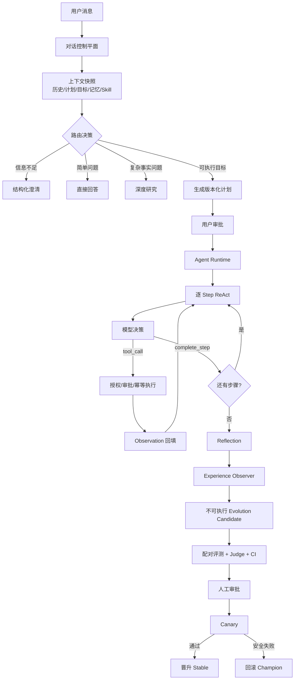
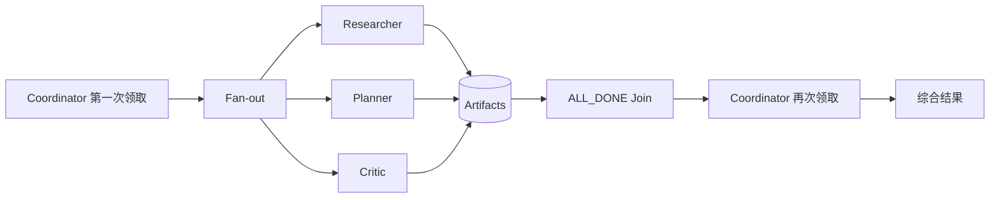

# Better Agent 项目导学：设计思想、代码思路与核心实现

> 适用场景：项目学习、技术答辩、简历项目深挖。本文基于当前仓库源码整理；类名和路径用于定位证据，不代表所有设计都已达到生产级分布式系统规模。

## 1. 前置知识

| 知识点 | 为何需要 | 在本项目中的位置 | 高频度 |
| --- | --- | --- | --- |
| 有限状态机与状态迁移 | Agent 不能只靠 Prompt 约束生命周期 | `backend/app/domain.py`、`backend/app/runtime.py` | 高 |
| ReAct（Reason + Act） | 理解模型决策、工具调用、观察回填的闭环 | `backend/app/runtime.py` | 高 |
| 事务、幂等与追加式日志 | 理解恢复、去重、审计和异常阻断 | `backend/app/events.py`、`backend/app/tools.py` | 高 |
| SQLite WAL、FTS5、CAS | 理解本地事实源、全文检索和版本冲突 | `backend/app/db.py`、`backend/app/memory_v2.py` | 高 |
| 租约、心跳与 Epoch Fencing | 理解专家任务并发、接管和迟到结果拒绝 | `backend/app/agents.py` | 高 |
| 模型路由与评测统计 | 理解多模型选择、成本账本与 Bootstrap CI | `backend/app/model_control.py`、`backend/app/real_evaluation.py` | 高 |
| 证据驱动生成 | 理解深度研究为何先取证、再写作、最后审计 | `backend/app/research/engine.py` | 中高 |

## 2. 重点亮点与学习顺序

| 亮点标题 | 为什么重要 | 通用技术关键词 | 先看哪些文件 | 顺序 |
| --- | --- | --- | --- | --- |
| 可恢复 Agent Runtime | 是所有任务执行能力的骨架 | FSM、ReAct、Checkpoint、Event Sourcing、Idempotency | `domain.py` → `runtime.py` → `tools.py` | 1 |
| 统一上下文与三层记忆 | 决定模型每次真正能看到什么 | Scope、FTS5、Token Budget、Revision、Redaction | `memory_v2.py` → `memory_archive.py` → `context.py` | 2 |
| 模型与成本控制面 | 把模型调用从 SDK 调用提升为可治理资源 | Capability Routing、Invocation/Attempt、Fallback、Ledger | `model_control.py` → `model_gateway.py` → `costs.py` | 3 |
| 证据优先的深度研究 | 体现长任务拆分、并发检索和质量门禁 | Plan-Retrieve-Distill-Reflect-Write-Audit | `research/engine.py` → `research/service.py` → `research/worker.py` | 4 |
| 受控专家协作 | 体现多角色并行、失败接管和结果汇总 | Coordinator、Fan-out/Fan-in、Lease、Heartbeat、Fencing | `agents.py` → `test_agent_tasks.py` → `test_agent_worker.py` | 5 |
| 受控自进化与配对评测 | 回答系统如何从运行经验中改进但不失控 | Experience、Candidate、Judge、Bootstrap CI、Canary、Rollback | `experience_observer.py` → `real_evaluation.py` → `evolution.py` | 6 |

## 3. 必备知识 Checklist

- [ ] 能区分前端 React 与 Agent 的 ReAct；本文中的 ReAct 指 `Reason → Act → Observation`。
- [ ] 能画出 `RECEIVED → CLARIFYING/PLANNING → AWAITING_APPROVAL → EXECUTING → REFLECTING → COMPLETED`。
- [ ] 能解释事件日志、Checkpoint 和业务表各自解决什么问题。
- [ ] 能解释“同一个 Invocation 多个 Attempt”，以及 retry 与 fallback 的区别。
- [ ] 能解释为什么成本必须先预留，再结算，再释放余额。
- [ ] 能解释 Scope 过滤为何必须发生在相关性检索之前。
- [ ] 能解释 Lease 过期后为什么仅靠 owner 校验仍不够，还需要 epoch。
- [ ] 能解释深度研究为什么不能让模型直接凭搜索摘要写最终答案。
- [ ] 能解释 Evolution 为什么不是在线自动改 Prompt，而是受控发布流程。

## 4. 推荐阅读

| 主题 | 通用技术点 | 建议阅读位置 | 预计时间 | 读完能回答什么 |
| --- | --- | --- | --- | --- |
| 状态与计划 | FSM、不可变版本、审批 | `backend/app/domain.py` | 30 分钟 | 非法状态跳转和并发修订如何被阻止 |
| 主执行循环 | ReAct、预算、阻断、恢复 | `backend/app/runtime.py` | 60 分钟 | 一次任务如何从澄清走到复盘 |
| 工具可靠性 | 风险分级、审批绑定、幂等 Claim | `backend/app/tools.py` | 35 分钟 | 重启后如何避免重复写入 |
| 模型控制面 | 能力路由、调用账本、显式切换 | `backend/app/model_control.py`、`backend/app/model_gateway.py` | 60 分钟 | 多供应商如何治理而不是散落在业务代码里 |
| 成本控制 | 价格快照、预算、追加式流水 | `backend/app/costs.py` | 35 分钟 | 并发调用为何不会一起透支预算 |
| 记忆与上下文 | 三层记忆、FTS5、Token Budget、Pin | `backend/app/memory_v2.py`、`backend/app/context.py` | 60 分钟 | 什么内容进入上下文、为什么可复现 |
| 深度研究 | 多阶段流水线、引用与覆盖审计 | `backend/app/research/engine.py` | 60 分钟 | 深度研究与普通搜索问答的差异 |
| 多 Agent | Fan-out/Fan-in、Lease、Epoch | `backend/app/agents.py` | 60 分钟 | Worker 宕机后怎样接管且拒绝旧结果 |
| 自进化评测 | 配对盲评、Bootstrap CI、Canary | `backend/app/real_evaluation.py`、`backend/app/evolution.py` | 75 分钟 | 候选版本如何获得发布资格 |

## 5. 自学提醒

若某个文件或原理看不懂，请继续追问 AI，让它按“调用入口 → 数据结构 → 正常路径 → 异常路径 → 对应测试”逐段讲解。本文负责给出学习路径、设计思想和题目，不代替逐行源码阅读。

## 6. 项目技术定位

这是一个以 Python/FastAPI/SQLite 为主的 **AI Agent 后端与控制面项目**。核心价值不是“接入一个大模型聊天接口”，而是把不确定的模型行为放进确定性的运行协议：任务生命周期由状态机控制，模型与工具调用被持久化，长期任务能够恢复，模型质量和成本能够评估，多专家与自进化都受到权限和发布门禁约束。

## 7. 系统全流程



系统分成两个平面：对话控制平面负责理解意图、拼上下文和决定“答、问、研究、计划”；任务执行平面负责把获批计划变成可恢复的 Run。SQLite 是权威事实源，SSE 和 Markdown 只是展示或投影。

## 8. 核心原理一：状态机 + ReAct Runtime

### 8.1 为什么同时需要状态机和 ReAct

ReAct 擅长解决“下一步做什么”：模型读取当前步骤和 Observation，返回继续思考、调用工具、完成步骤、等待外部结果或阻断。它不擅长保证系统级不变量，例如未审批不能执行写操作、任务完成后不能重新进入执行态、预算耗尽必须停止。

因此项目采用双层控制：

- 外层有限状态机约束生命周期，非法迁移直接抛出 `InvalidTransition`。
- 内层 ReAct 只在 `EXECUTING` 状态、当前 Plan Step 和剩余预算内运行。
- 模型给建议，Runtime 决定建议是否可执行。

核心状态定义位于 `backend/app/domain.py:14`，迁移表位于 `backend/app/domain.py:38`，执行器位于 `backend/app/runtime.py:132`。

### 8.2 ReAct 是怎么用的

本项目没有保存模型的隐藏思维链，只持久化可审计的决策摘要、工具请求和 Observation。简化后的核心代码思路如下：

```python
while run.state == EXECUTING:
    step = current_approved_plan_step()
    ensure_budget_remaining(step)

    decision = model.decide(step, observation, react_iteration)
    record_model_decision(decision)  # 只记录外显决策，不记录隐藏 CoT

    if decision.kind == "continue":
        observation = decision.observation
    elif decision.kind == "tool_call":
        result = tool_registry.execute(bound_call, run_id=run.id)
        observation = normalize_tool_result(result)
    elif decision.kind == "await_outcome":
        transition(AWAITING_OUTCOME)
        save_checkpoint()
        return
    elif decision.kind == "complete_step":
        mark_step_completed_with_cas()
        reset_step_react_budget()
    else:
        block_run(reason=decision.summary)

transition(REFLECTING)
reflect_and_finish()
```

真实入口集中在 `AgentRuntime._execute_locked()` 和 `_execute_step()`。每个计划步骤都有独立 ReAct 预算，预算耗尽会保存 Checkpoint 并进入 `BLOCKED`；用户追加预算后才允许恢复。这样避免模型“想不明白就无限循环”。

### 8.3 为什么不用固定 DAG

固定 DAG 适合步骤和依赖完全已知的工作流，但通用 Agent 经常要根据工具结果动态选择下一步。纯 ReAct 又容易失控。项目选择“版本化计划作为粗粒度骨架 + Step 内 ReAct 作为细粒度适应”的折中：计划提供可审批、可展示的边界，ReAct 处理局部不确定性。

## 9. 核心原理二：恢复、去重与异常阻断

### 9.1 Event、Checkpoint、业务表不是一回事

- 业务表保存当前权威状态，例如 Run 当前状态、计划当前版本和工具调用结果。
- Append-only Event 保存“发生过什么”，用于轨迹、审计和投影重建。
- Checkpoint 保存恢复所需的最小快照，包括状态、计划版本、步骤、ReAct 迭代、剩余预算、Observation、Pending Approval/Action 和已应用记忆版本。

恢复时先读业务状态和最新 Checkpoint，再从 `last_event_seq` 之后补事件，而不是重放模型的隐藏思考。

### 9.2 工具调用如何幂等

只用 `tool_call_id` 不够，因为模型重试可能换 ID；只用参数 Hash 也不够，因为两个合法相同参数的动作可能本来就要执行两次。项目把逻辑动作绑定到 Run、工具、参数和调用身份，在事务内抢占 `tool_execution_claims`：

```python
claim = claim_execution(logical_action_key, run_id, tool_call_id, params_hash)
if claim.status == "COMPLETED":
    return stored_receipt
if claim.status == "RUNNING" and ownership_uncertain:
    mark_reconciliation_required()
    block_run()  # 不盲目重放可能已经产生副作用的写操作

result = execute_tool()
commit_result_and_claim_atomically(result)
```

WRITE 工具还必须匹配 `run_id + tool_call_id + params_hash + binding_digest` 的显式审批。参数发生任何变化，旧审批都不能复用。相关实现见 `backend/app/tools.py:201` 与 `backend/app/domain.py:298`。

### 9.3 异常为什么要“阻断”而不是一直重试

超时不等于未执行，尤其是外部写操作。若系统在写入后、回执落库前崩溃，自动重试可能造成重复副作用。因此项目将“不确定结果”标记为需要 reconciliation，保存轨迹并暂停，让外部幂等键、查询接口或人工确认消除不确定性。这是可靠 Agent 与普通脚本的重要区别。

## 10. 核心原理三：模型路由、调用账本与成本控制

### 10.1 模型路由

模型 Profile 记录供应商协议、模型名、能力、上下文窗口、超时、最大尝试次数和凭证环境变量引用。路由策略按角色配置候选序列，例如 planner 需要 JSON，executor 需要 tool calling。`ModelRouter` 先做能力硬过滤，再按优先级稳定选择。

故障切换是显式的：仅 `timeout/rate_limit/server/provider_unavailable` 等白名单错误可进入下一个 Profile；认证错误、结构错误、预算错误不会静默切换。每次 fallback 都产生新 Attempt 和事件，因此可以回答“为什么换模型、换了几次、最终用了哪个”。

### 10.2 Invocation 与 Attempt 为什么分开

`Invocation` 表示一次逻辑模型请求，冻结请求摘要、工具 Schema 摘要、上下文摘要、路由策略摘要和 Profile 序列；`Attempt` 表示该逻辑请求在某个具体模型上的一次物理尝试。

```text
Invocation（逻辑请求，只创建一次）
  ├─ Attempt 1：primary，timeout
  ├─ Attempt 2：retry，rate_limit
  └─ Attempt 3：fallback，succeeded
```

这种建模避免把重试次数误算成业务请求数，也能分别统计成功率、fallback 率、TTFT、P95 延迟和成本。`idempotency_key` 与 `request_digest` 绑定；同一键对应不同请求会报冲突，而不是复用错误结果。

### 10.3 `RESERVE/CHARGE/RELEASE` 成本流水

直接在响应回来后扣费存在并发超卖：多个请求都可能在开始时看到“余额充足”。项目在 Attempt 开始前按上下文窗口和最大输出估算最坏成本并预留；结束后按真实 usage 和不可变价格快照结算，多余部分释放。

```python
with transaction():
    assert reserved + charged + worst_case <= limit
    append_ledger("RESERVE", worst_case)
    budget.reserved += worst_case

response = call_provider()
actual = estimate_cost(response.usage, frozen_price_snapshot)

with transaction():
    append_ledger("CHARGE", actual)
    append_ledger("RELEASE", worst_case - actual)
    budget.reserved -= worst_case
    budget.charged += actual
```

流水是追加式的，预算表是可快速查询的投影。每条流水有幂等键；结算使用同一价格快照，避免价格配置变化后历史成本漂移。当前成本单位为 `microusd`，支持 Invocation、日、月三个周期的预算门禁。

### 10.4 如何比较模型质量、成本和延迟

项目不是对两批独立问题简单求平均，而是让 baseline 与 candidate 跑同一条 case：

1. 平衡执行先后，降低缓存、热身或时序偏差。
2. 输出随机放到 left/right，Judge 不知道模型身份。
3. 质量 Judge 与安全 Judge 独立于两个被评模型。
4. 同一 case 计算质量胜负、TTFT 差和成本差，形成 paired sample。
5. 对配对差值做 2,000 次 Bootstrap，得到 95% 置信区间。
6. 主目标只有在置信区间下界不小于阈值时通过，同时还要过安全、确定性和总预算门禁。

核心统计见 `backend/app/real_evaluation.py:962` 和 `backend/app/real_evaluation.py:986`。

## 11. 核心原理四：三层记忆与统一上下文

### 11.1 三层记忆分别解决什么

| 层级 | 内容 | 生命周期 | 写入方式 |
| --- | --- | --- | --- |
| 短期记忆 | 当前线程最近消息和活跃计划 | 对话级 | 消息直接落库，旧消息可归档 |
| 经历记忆 | 一次任务发生了什么、结果和教训 | 任务/阶段级 | 对话归档或 Run 结束后生成 Episode |
| 长期记忆 | 稳定偏好、约束、事实和习惯 | 跨会话 | 明确记住或带证据的 Proposal 经确认后写入 |

关键原则是“写入门槛逐层提高”：短期内容不能未经审查直接变成长期事实，否则模型误解会永久污染用户画像。

### 11.2 Scope、FTS5 与 Token Budget

统一读取流程不是“全库相似度 Top-K”，而是：

```text
Owner 隔离
  → Scope 硬过滤（user / 当前 project）
  → FTS5 候选召回
  → pinned、命中、scope、importance 的稳定排序
  → semantic 与 episodic 分桶 Token Budget
  → 脱敏渲染
  → Invocation Pin（记录本次到底用了哪些 revision）
```

Scope 必须先于检索，保证另一个项目的高相关敏感内容没有机会进入候选集。当前使用 SQLite FTS5；优先 trigram tokenizer，不支持时回退 unicode61。它适合本地单用户、数据规模有限的第一版，也符合 README 中“当前不包含向量检索”的边界。

### 11.3 版本、回滚与可复现上下文

长期记忆不是原地覆盖。`memory_entries` 指向当前 revision，编辑和回滚都创建或切换版本；CAS 的 `base_revision_id` 防止旧页面覆盖新修改。每次模型调用把 revision IDs、episode IDs、预算、tokenizer/renderer 版本和 rendered hash 写入 Context Pin。因此即使记忆之后被修改，也能解释历史调用当时看到了什么。

脱敏在归档和上下文渲染阶段执行，敏感值不会因为进入 Markdown 投影而绕过数据库策略。SQLite 是权威源，`data/memory/*.md` 是可重建的只读投影。

## 12. 核心原理五：深度研究

深度研究不是“搜一次网页后让模型总结”，而是一条证据流水线：

```text
研究规划
  → 多 Query 并发检索
  → URL/内容 Hash 去重与确定性过滤
  → 逐来源提炼 Evidence
  → 检查证据缺口并最多补搜一轮
  → 为章节分配 Evidence ID
  → 分节写作并携带引用标记
  → 引用解析
  → 覆盖审计
  → 修复一次或明确失败
```

`ResearchEngine.run_research()` 以事件流输出阶段进度。检索和逐源提炼分别用 `Semaphore(4)` 控制并发，并为单次检索、提炼、模型阶段设置超时。来源按 canonical URL 或 content hash 去重，Evidence 必须带 `source_id` 和 relevance。

写作阶段只能引用已经进入证据池的 ID；未知引用会抛出 `UnknownCitation`。最终还要检查是否覆盖所有计划章节、是否存在来源和证据、正文引用是否合法。审计失败时可以基于已有 Evidence 做一次修复；仍不通过则以 `TopicCoverageError` 阻断，不能把证据不足的报告伪装成成功。

这种设计把模型擅长的语义规划、提炼和写作，与程序擅长的去重、超时、引用闭包和覆盖门禁结合起来。

## 13. 核心原理六：Multi-Agent 协作

### 13.1 角色与协作流程

Coordinator 不亲自完成所有分析，而是把同一份不可变 Context Snapshot 分发给三个只读专家：

- Researcher：整理事实、证据与未知项。
- Planner：给出步骤、依赖、约束和执行顺序。
- Critic：寻找风险、反例、遗漏和安全问题。
- Coordinator：等待子任务结束，读取结构化 Artifact，综合最终建议。



专家输出必须满足 schema，Artifact 只保留 summary、findings、risks、open_questions、safety_pass 等允许字段。专家不直接修改 Plan、Memory、Goal 或 Runtime Bundle；权威写入仍由主 Runtime 或用户审批完成。

### 13.2 Lease、Heartbeat 与 Epoch Fencing

Worker 领取任务时原子写入 `lease_owner`、`lease_until`，并把 `lease_epoch + 1`。执行期间定时 heartbeat 延长租约。若 Worker 崩溃，租约过期后任务可重新排队，由新 Worker 以更大的 epoch 接管。

所有 Checkpoint、完成、失败和 Artifact 提交都必须满足：

```sql
status = 'RUNNING'
AND lease_owner = :owner
AND lease_epoch = :epoch
AND lease_until > now()
```

旧 Worker 即使恢复并迟到提交，因为 epoch 已过期也会被拒绝，只记录 `late_result_rejected` 的 Hash。这个 epoch 就是 fencing token，解决“旧 owner 在网络分区后复活”的脑裂写入问题。

### 13.3 Fan-out/Fan-in 与失败语义

Fan-out 使用稳定的 `child_key` 并校验 payload，重复调度返回原有子任务，不重复创建。系统限制最大深度、子任务数和预算单位。Join 支持：

- `ALL_SUCCESS`：任一子任务失败，父任务失败。
- `ALL_DONE`：全部进入终态即可重新唤醒 Coordinator，允许带 `failed_roles` 做降级综合。

当前默认专家协作采用 `ALL_DONE`，只有全部专家失败才整体失败；部分专家失败会生成 `incomplete` 结果，让用户看到降级而不是假装完整。

## 14. 受控自进化

### 14.1 “自进化”在这里的准确含义

它不是让模型在线修改自己的核心代码或安全策略，而是把重复运行问题转成不可执行候选，经评测和发布门禁后更新版本化 Runtime Bundle。完整链路为：

```text
运行轨迹
  → Experience Observer 提取可见失败模式
  → 相同模式达到条件后生成 Candidate
  → 冻结 baseline/candidate/工具/上下文/价格/Judge
  → 确定性检查 + 配对盲评 + 安全 Judge + Bootstrap CI
  → 人工审批（绑定各类 digest）
  → Canary 哈希分流
  → 样本和安全门禁
  → Promote 或 Rollback
```

Observer 只观察可见事件和结果，不读取隐藏思维链；Candidate 只是 Prompt/行为配置的提案，不能直接执行。审批绑定 candidate digest、evaluation report digest、permission diff digest 和 target bundle digest，防止“评的是 A、发的是 B”。

### 14.2 Canary 和回滚

Canary 用稳定 assignment hash 把 Run 分到 champion 或 challenger，并记录 Exposure。达到最小样本数、没有待定安全结果、没有安全失败和执行失败后才允许晋升。若 challenger 出现安全失败，系统自动把 channel 指回 champion 并将 Candidate 标为 rolled back；人工也可显式回滚。

因此更准确的面试表达是“构建受控持续改进闭环”，而不是“实现完全自主进化”。

## 15. 关键设计决策

| 决策 | 备选 | 为什么这样选 | 风险 | 验证方式 |
| --- | --- | --- | --- | --- |
| FSM 外控 + Step 内 ReAct | 纯 DAG / 纯 ReAct | 同时获得可控生命周期和局部适应性 | 状态与计划一致性复杂 | 状态迁移、预算、恢复测试 |
| SQLite 为单一事实源 | Redis + MQ + 多服务 | 本地单用户场景部署简单，事务边界清楚 | 写并发和水平扩展有限 | WAL、事务和故障注入测试 |
| FTS5 而非向量库 | Embedding + Vector DB | 第一版无需外部服务，结果稳定可解释 | 语义召回有限 | 构造同义词/精确词检索集对比，当前为待测 |
| 显式 fallback | 任意错误自动切换 | 避免认证、结构或预算问题被掩盖 | 可用性可能低于激进切换 | 错误分类与 fallback 轨迹测试 |
| 先预留成本 | 调完再扣费 | 防止并发预算超卖 | 最坏估算可能降低预算利用率 | 并发预留与账本配平测试 |
| 只读专家 + Coordinator 汇总 | 多专家直接共享写状态 | 降低冲突和权限扩散 | 专家能力受限 | 迟到写拒绝、Artifact schema 测试 |
| 受控 Evolution | 在线自动改 Prompt | 可评测、可审批、可回滚 | 改进周期更长 | 配对评测、Canary、回滚测试 |

## 16. 量化与验证

仓库已有模块级测试覆盖状态迁移、重启恢复、工具去重、成本控制、模型路由、记忆、研究、多 Agent、评测和 Evolution。不要把“测试通过”直接写成线上收益；建议补齐以下可度量指标：

| 目标 | 指标 | 测量方法 | 当前状态 |
| --- | --- | --- | --- |
| Runtime 可靠性 | 恢复成功率、重复副作用率、平均恢复时间 | 故障注入：模型响应前后、工具执行前后、回执落库前后杀进程 | 待测 |
| 模型治理 | 成功率、fallback 率、TTFT、P95、每任务成本 | 按 Invocation/Attempt 账本聚合 | 代码已支持，生产数据待测 |
| 记忆质量 | Recall@K、错误 Scope 泄漏率、Token 利用率 | 构造跨项目检索集与上下文快照审计 | 待测 |
| 深度研究 | 引用正确率、章节覆盖率、无证据 Claim 率 | 人工标注研究集 + 确定性引用审计 | 待测 |
| 多 Agent | 接管时延、迟到提交拒绝率、部分失败完成率 | Lease 过期和 Worker Crash 故障注入 | 待测 |
| Evolution | 候选胜率、安全失败率、回滚时间 | 离线配对评测 + Canary Exposure | 待测 |

建议验证命令：

```powershell
Set-Location backend
python -m pytest -q tests/test_runtime.py tests/test_restart_recovery.py tests/test_tool_execution_claims.py
python -m pytest -q tests/test_model_control.py tests/test_cost_control.py tests/test_real_evaluation.py
python -m pytest -q tests/test_memory_v2.py tests/test_research_engine.py tests/test_agent_tasks.py tests/test_evolution.py
```

## 17. 一分钟项目讲解

我做的不是一个单轮聊天封装，而是一个本地 Personal Agent Runtime。系统先在对话控制平面完成澄清、上下文拼装和任务路由，复杂任务进入版本化计划；计划获批后，外层状态机控制生命周期，内层在每个 Step 中运行 ReAct。所有模型调用、工具回执、事件和 Checkpoint 都持久化，写工具通过审批绑定与幂等 Claim 防止重复副作用。模型侧用能力路由、显式 fallback 和 Invocation/Attempt 账本治理，并用追加式成本流水做预算预留和结算。能力层还包含 Scope 隔离的三层记忆、证据优先的深度研究、带 Lease/Heartbeat/Epoch 的专家协作，以及“经验 → 候选 → 配对评测 → 人工审批 → Canary → 晋升/回滚”的受控改进闭环。

## 18. 源码证据索引

| 主题 | 关键路径与内部符号 | 对应正文 |
| --- | --- | --- |
| 状态机 | `backend/app/domain.py`：`AgentState`、`StateMachine` | 第 8 节 |
| ReAct | `backend/app/runtime.py`：`AgentRuntime._execute_locked`、`_execute_step`、`_model_call` | 第 8 节 |
| Checkpoint | `backend/app/domain.py`：`CheckpointStore`；`runtime.py`：`_save_checkpoint` | 第 9 节 |
| 工具幂等 | `backend/app/tools.py`：`_claim_execution`、`_mark_reconciliation` | 第 9 节 |
| 审批绑定 | `backend/app/domain.py`：`ApprovalService`、`normalized_params_hash` | 第 9 节 |
| 模型账本 | `backend/app/model_control.py`：`ModelControlStore`、`RoutedModelGateway` | 第 10 节 |
| 成本流水 | `backend/app/costs.py`：`reserve_attempt`、`settle_attempt`、`RESERVE/CHARGE/RELEASE` | 第 10 节 |
| 配对评测 | `backend/app/real_evaluation.py`：`evaluate_paired`、`_paired_statistics`、`_bootstrap_ci` | 第 10、14 节 |
| 三层记忆 | `backend/app/memory_v2.py`：`MemoryStore`、`MemoryContextProvider` | 第 11 节 |
| 对话归档 | `backend/app/memory_archive.py`：`ConversationArchiver` | 第 11 节 |
| 上下文 | `backend/app/context.py`：`ContextAssembler`；`memory_v2.py`：Context Pin | 第 11 节 |
| 深度研究 | `backend/app/research/engine.py`：`ResearchEngine.run_research` | 第 12 节 |
| 专家协作 | `backend/app/agents.py`：`AgentTaskService`、`ManagedAgentWorker` | 第 13 节 |
| 经验观察 | `backend/app/experience_observer.py`：`ExperienceObserver` | 第 14 节 |
| 受控进化 | `backend/app/evolution.py`：`EvolutionService`、`EvolutionCandidateGenerator` | 第 14 节 |
